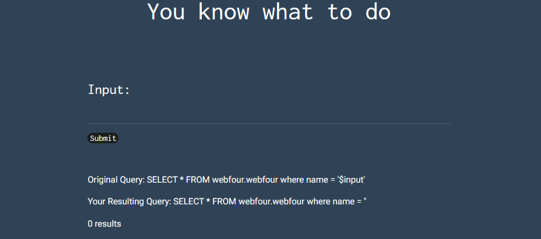

# Basic Injection

## Procedure
1. On the default page of this lab, we can observe that it takes user input.  
It also presents the `Original Query` as well as the `Resulting Query`  

2. A good habit to have is to always check the source code for any hints.
