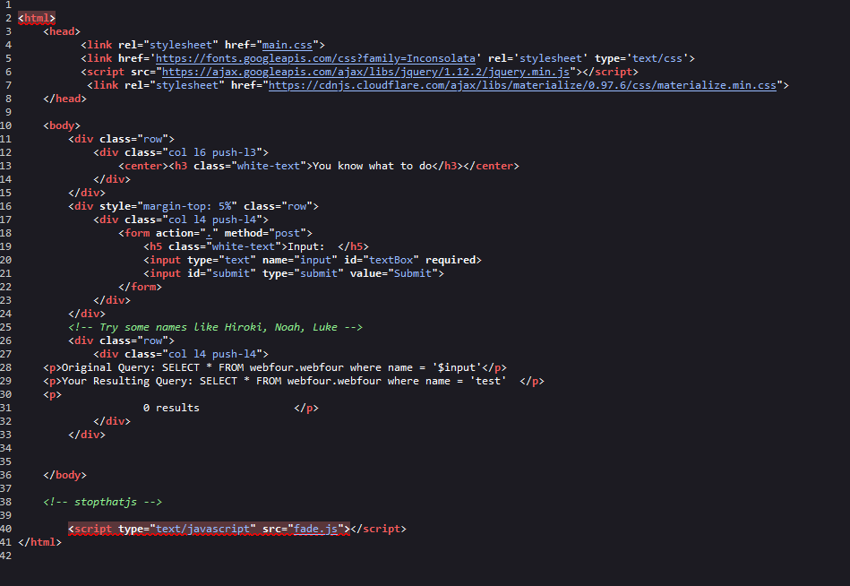

# Basic Injection Lab
Vulnerability Found: `SQL Injection (SQLi)`  
Flag: `CTFlearn{th4t_is_why_you_n33d_to_sanitiz3_inputs}`

## Proof of Concept
1. On the default page of this lab, I can observe that it takes user input.  
It also presents the `Original Query` as well as the `Resulting Query`  

2. A good habit to have is to always check the source code for any hints.
We can see in the source code that it gives a helpful hint in the form of a comment.
Similar to the home page of the application, we can see the query used by the web app
It looks like it's searching for data in the `webfour` database in the `webfour` table

3. I tried testing out "Luke" and got data back in the response. It seems that it looks for usernames
and gives data based on the username found.  

4. I inserted the following payload: `' OR 1=1-- -`  
This is a `boolean-based SQLi` payload. It allows me to escape from the logic
of the original query, and let's me see all data (*) in `webfour.webfour`  

