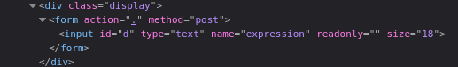
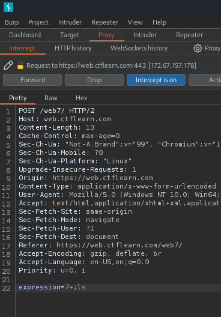
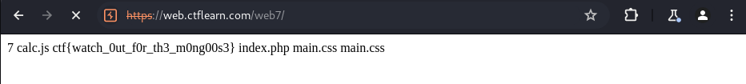

# Calculat3 M3 Lab 
vulnerability:  `command injection`  
flag: `ctf{watch_0ut_f0r_th3_m0ng00s3}` 

## Proof of Concept
1. Take a look at the web page's HTML using `right click -> inspect`. I found that the web application uses a POST request with the user data parameter called `expression`. The web application sends the value of `expression` to the backend where it then processes the calculation then sends it back to the frontend.  

2. I assume that there is PHP code in the backend that processes the user input with logic like (assume user inputted "7+2" as `expression` in the calculator):  
```
<?php
	if (isset($_POST['expression'])) { 
		$expression = $_POST['expression']; 

		$result = shell_exec($expression); 
		
		echo $result; 
	}
?>
```
> **shell_exec()** executes a command via the system's shell and returns the output of the command as a string
> **passthru()** has no return value, unlike shell_exec(), it directly outputs the result to the browser
3. Having an idea of what the source php script looks like as well as what the web application is doing is vital to understanding what kind of vulnerabilities can exist within a web app. From here, I intercepted the POST request using `burp suite` and injected a simple `command injection` payload in the `expression` data parameter: `;ls`  

4. In the response of this intercepted and altered POST request, I see the listings of the current directory on the web application, which includes the flag!  

