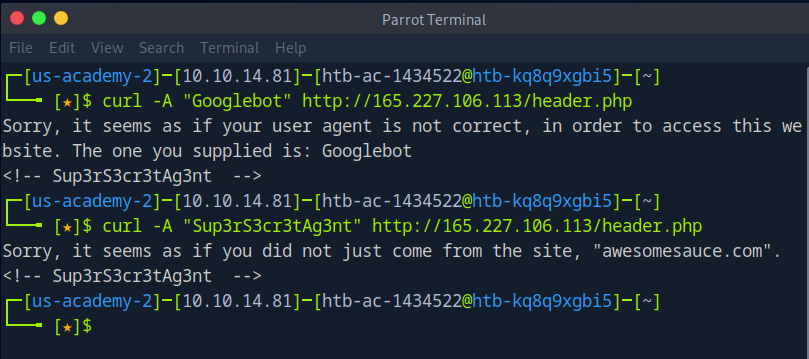
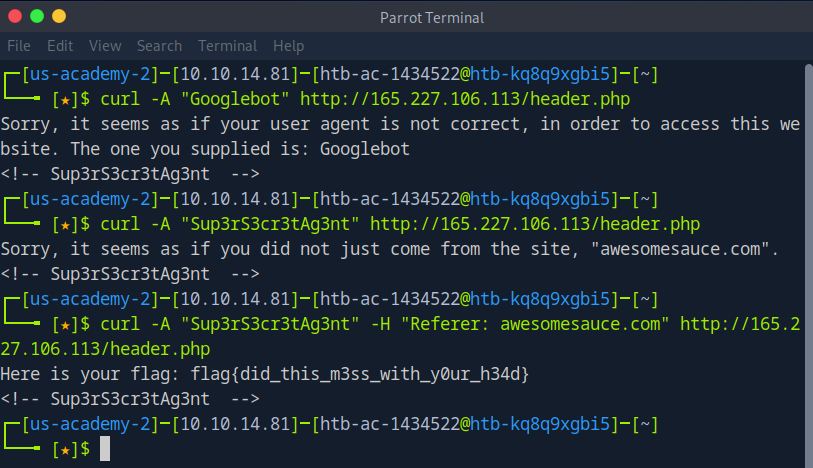

# Don't Bump Your Head(er) Lab
Vulnerability Found: `User-Agent and Referer Spoofing`  
Flag: `flag{did_this_m3ss_with_y0ur_h34d}`

## Proof of Concept
1. On the default page of this lab, I can observe that it presents me with a single string:   
`Sorry, it seems as if your user agent is not correct, in order to access this website. The one you supplied is: Mozilla/5.0 (Windows NT 10.0; Win64; x64; rv:133.0) Gecko/20100101 Firefox/133.0`

2. It does not specify which `user-agent` it is looking for. So, I used "Googlebot" `(Google's web crawler)` as a test user-agent to see if I could get gain more clues or even trigger a different kind of authentication error.
!(images/bump-header-agent.png)

3. In the ouput of my `curl` command, I see a comment: 
`<!-- Sup3rS3cr3tAg3nt  -->`   
So, I use that as my `user-agent`, by utilizing the `-A` flag  

4. Fortunately, I see that by using this specific user-agent, I was able to render a different response from the site.  
It looks like I have to spoof the `referer` header in my http request in curl by utilizing the `-H` flag  

## Notes
* `User-Agent`: a string that tells a website what kind of device or software is visiting. Think of it as a `name tag`
* `Referer`: the URL of the page you were on before clicking a link to visit a new page.
* `Googlebot` is Google's web crawling bot that indexes web pages for the Google search engine. It systematically browses websites, gathers data about their content, and adds that information to Google's search index. It can also be used as an `user-agent`
* `curl`: is a command-line tool used to make HTTP requests to web servers. When you use curl with an HTTP URL, it sends a request to the server and returns the server's response. The output typically includes the content of the webpage or data, HTTP status codes, headers, and other relevant information.
	* `-u` used for authentication
	> curl -u username:password http://example.com
	* '-H' used to add custom headers to the request 
	> curl -H "Content-Type: application/json" http://example.com
	* `-A` used to specify the "User-Agent" string, which tells the server what browser or client is making the request.
	> curl -A "Mozilla/5.0" http://example.com
