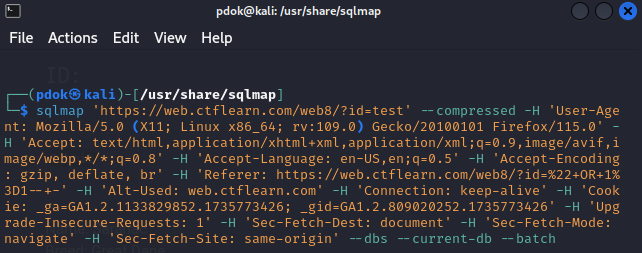
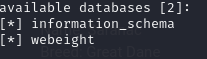
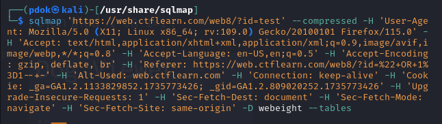
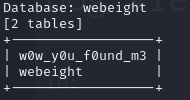
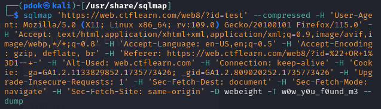
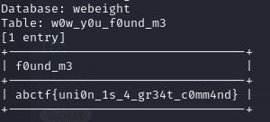

# Inj3ction Time Lab
Vulnerability Found: `SQLi`  
Flag: `abctf{uni0n_1s_4_gr34t_c0mm4nd}`  
Tool: `SQLMap`

## Proof of Concept
1. I first tried to break the SQL output by submitting payloads such as:  
* `'`
* `"`
* `' OR 1=1-- -`
* `" OR 1=1-- -`  
But it did not seem to render any output from the database. 
2. I opened the developer tools in the browser and looked under the `network` tab to copy the request as `cURL`. I copy and pasted this request in the command line and replaced `curl` with `sqlmap`.  
  
3. I gained information about the target site's database and web server by running this command in the terminal:  
* `back-end DBMS`: MySQL
* `web server OS`: Linux Ubuntu
* `web application technology`: PHP 5.5.9  

3. Through my initial sqlmap command, I also found that the `id` parameter in the URL of the target site is vulnerable to `time-based blind SQLi`  

4. Because sqlmap was successful in its first run, I thought it would be a good idea to extend on this and use the found vulnerablity to enumerate the databases that the web application is using. I used the `--dbs` option in sqlmap to give me a list of the available databases.  
  

5. I know that `information_schema` is a general/standardized database that all mySQL servers use, so my database of interest is `webeight`. I want to extract data and information from this database, starting with listing the different tables. To do this, I use the `-D` option to specify the database I'm selecting, and the `--tables` option to tell sqlmap that I want a list of the tables under `webeight`.   
    

6. One table stands out: `w0w_y0u_f0und_m3`, so I decide to extract data from this table using: `-D` to specify the database, `-T` to specify the table, and `--dump` to "dump" the information from that table.  
   

