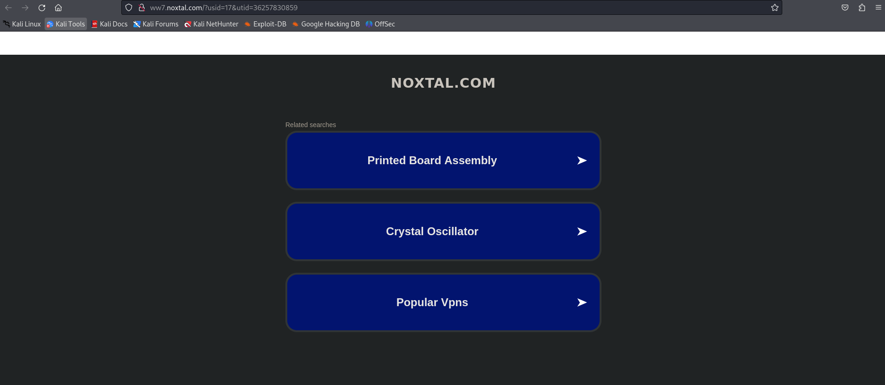
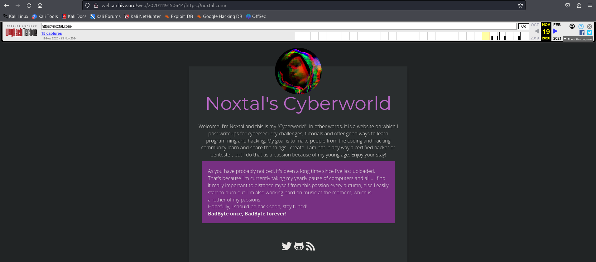

# My Blog Lab
Vulnerability Found: `N/A`  
Flag: `N/A`  
**The target/vulnerable site related to this lab is down. I will update this write up when/if the target site is back up** 
## Proof of Concept
1. When I navigated to the target site of this lab, I realized I had some kind of error when I saw this:   

2. To make sure what I got from the link is consistent with what it should look like, I utilized the `wayback machine`:  

3. Because the content on wayback machine's rendering of the target site is vastly different and actually contains content of how the target site **should** look like, I can assume that the target site is no longer up and running.
4. However, I can assume from reading the prompt of the lab, that it deals with reading/interacting with the `storage` tab within the brower's developer tools. I will include some notes that I took for this lab that I think will be helpful for me to solve it when it becomes available again.
## Notes
The **Wayback Machine** is an internet archive that allows users to view historical snapshots of websites from different dates.
### 1. **Cache**:  
   - **What it is**: It's like **saving a book in your bag** so you can read it later without going back to the library.
   - **Why it’s used**: Your browser saves things like images, styles, or scripts to load the page faster next time.  
   - **How long it lasts**: The browser keeps it for a while, even if you close and reopen the browser. 

### 2. **Local Storage**:  
   - **What it is**: Imagine **writing a note** and sticking it in a drawer that stays there forever.
   - **Why it’s used**: Websites can store data you need (like your login info) on your computer for the long term.  
   - **How long it lasts**: It stays there even if you close the browser, until you delete it yourself.

### 3. **Session Storage**:  
   - **What it is**: It’s like **writing a note** but only keeping it on your desk for today. Once you close your browser, it disappears.
   - **Why it’s used**: Websites store temporary data while you're on a page, like if you filled out a form but haven't submitted it yet.  
   - **How long it lasts**: It only lasts until you close the tab or browser.

