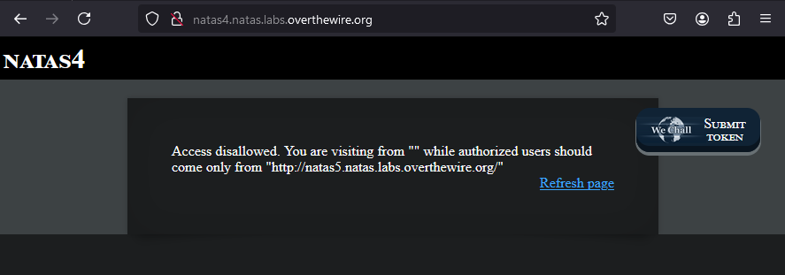
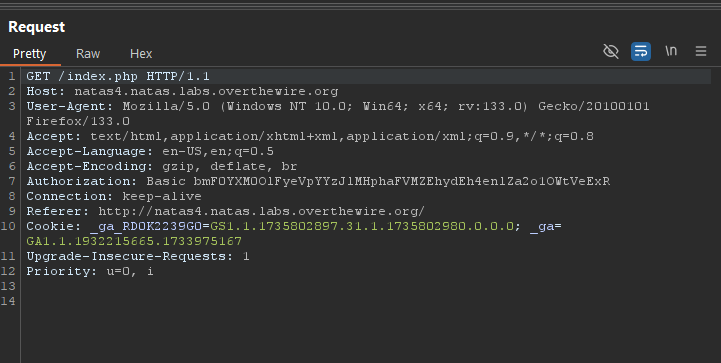
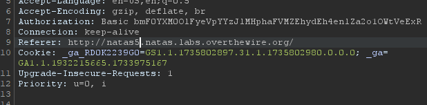
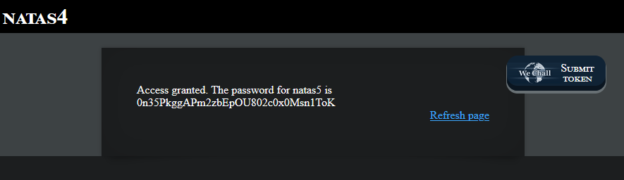

# Natas4 (Level 3 -> 4)

  * username: `natas4`   
  * password: `QryZXc2e0zahULdHrtHxzyYkj59kUxLQ`  
  * url: `http://natas4.natas.labs.overthewire.org`  
  * flag: `0n35PkggAPm2zbEpOU802c0x0Msn1ToK`  
  * vulnerability: `Referer Spoofing`  

## Proof of Concept

1. From the start of the challenge, I am presented with a box with useful text:  
  
2. It contains a big hint: `You are visiting from "" while authorized users should come only from "http://natas5.natas.labs.overthewire.org/"`. This challenge requires me to have knowledge on HTTP headers and what their functions are. Please refer to my notes section within this file! 
3. Knowing that this web app uses the `Referer` HTTP header for authentication, I can reload the page, and intercept the request with `Burp Suite`:  
  
4. From here, I can directly edit the `Referer` HTTP header by changing the `4` to a `5.`  
  
5. In order to gain access to the web application's hidden page and flag, you must click `forward` on Burp Suite after you intercepted and altered the `Referer` HTTP header:   

## Notes
1. The `referer` HTTP header is sent by browsers to indicate the URL of the webpage that initiated the request for a resource. It allows the server to track the origin of the request. 
