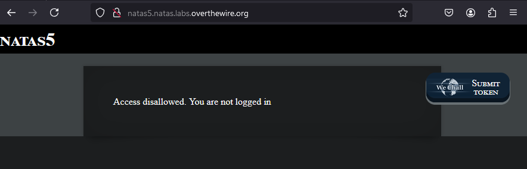
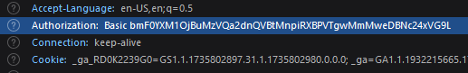
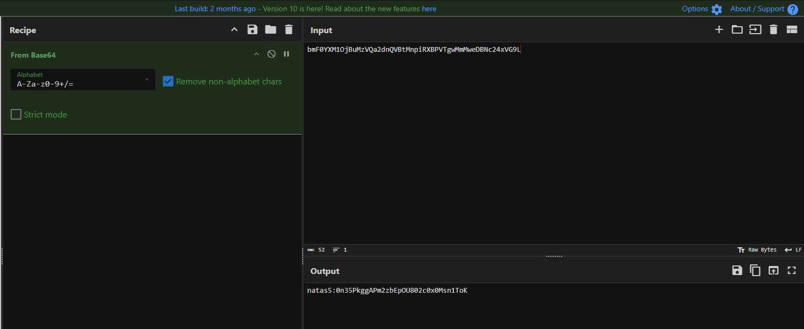
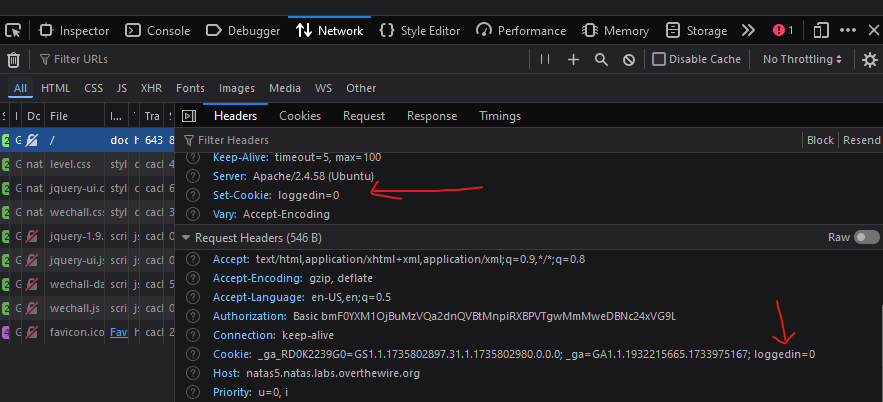
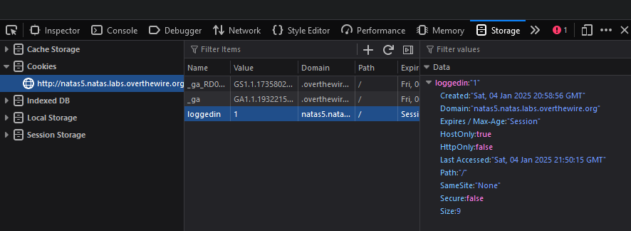
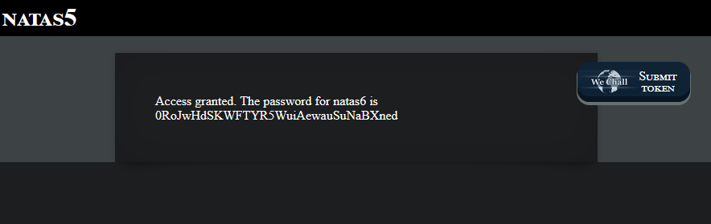

# Natas5 (Level 4 -> 5)

  * username: `natas5`
  * password: `0n35PkggAPm2zbEpOU802c0x0Msn1ToK`
  * url: `http://natas5.natas.labs.overthewire.org`
  * flag: `0RoJwHdSKWFTYR5WuiAewauSuNaBXned`
  * vulnerability: `Cookie Spoofing/Manipulation`

## Proof of Concept

1. From the start of the challenge, I am presented with a box with the following text:  
  
2. It contains a big hint: `Access disallowed. You are not logged in.` My first thought was to check the `network` tab in Firefox's developer tools so I can check the values for the `authorization` and `cookie` headers. When I checked the `authorization` header, it contained `basic` which refers to a simple method of authentication where the server checks the credentials (username and password) sent by the client. I went ahead and used `cyberchef` to decode the value:  
  
  
3. It looks like the value of basic are the values I provided natas in order to access this level. In theory, I could manipulate this, but I do not know the password value for `natas6.` So, I go ahead and move on to look at the `cookie` values for this challenge:  

4. There seems to be numerous cookies used, however I can skip the ones that start with `_ga` (please refer to my notes), and focus on the `loggedin` cookie, which has a value of `0.`  
> What if this cookie value uses a binary theme? What if 0 is `False` and 1 is `True`

Luckily, I do not need to run Burp Suite to intercept the request and change the `loggedin` cookie value. Instead, I can edit it directly in the developer tools and reload the page by navigating to the `storage` tab:

5. I gained access to the flag! YAAAAHOOOOO!  

## Notes
* `cookies` are small text files stored on a user's device by a web browser to remember information about their session, preferences, or `authentication status`
* The `Authorization` http header is used to provide credentials (like tokens or API keys) to authenticate a user or client with a server
* `Authorization Basic` is an HTTP authentication method where the client sends a username and password, encoded in `Base64`, in the Authorization header. 
  * When you enter your username and password on a login attempt, the browser combines them into a single string `(username: password)`, encodes it, and sends it int he Authentication header. 
* The `_ga` cookie(s) are used by `Google Analytics` to track and distinguish users on a website for analytics purposes. 
* `loggedin` is not a standard cookie, but websites often create a cookie with a similar name to indicate a user's login status. 

