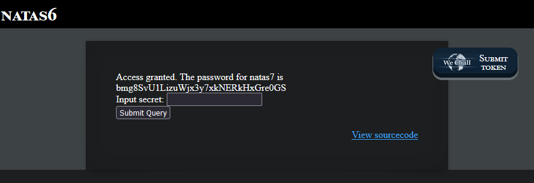

# Natas6 (Level 5 -> 6)

  * username: `natas6`  
  * password: `0RoJwHdSKWFTYR5WuiAewauSuNaBXned`  
  * url: `http://natas6.natas.labs.overthewire.org`  
  * flag: `bmg8SvU1LizuWjx3y7xkNERkHxGre0GS`  
  * vulnerability: `Source Code Disclosure/Information Leakage`  

## Proof of Concept

1. On the home page of this challenge, I see an input box that expects a specific `secret` or `code` for me to input in order to gain access to the password:  

2. I can verify this by clicking on the `View sourcecode` button on the page:  

3. I see that within the source code, there is a PHP snippet that utilizes the `include` function. From here, I'm able to see the path to a particular file named `secret.inc.` Interesting! (please refer to the notes section if needed)
4. I append `/includes/secret.inc` to the url of the challenge and gain access to the .inc file, which contains the password needed for this challenge! YAAAAAHOOOO!  

5. Now, all that's left to do is to copy and paste this password into the home page of the challenge, and I will now have access to the flag:  

## Notes
* `include()` is a function used to include and execute the contents of one PHP file within another
* A `.inc` fileis a file extension commonly used in web development, particularly with PHP, to store reusable code, such as functions, configurations settings, or scripts meant to be `included` in other files

