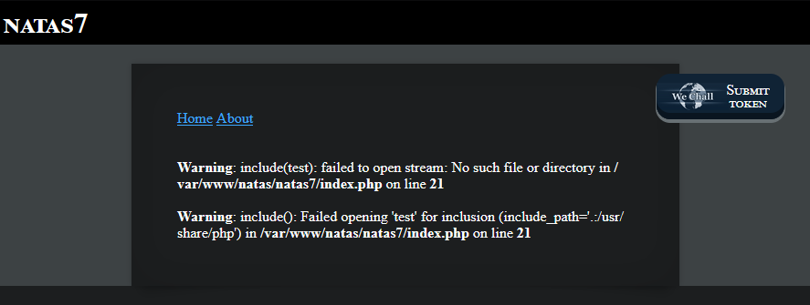

# Natas7 (Level 6 -> 7)

  * username: `natas7`  
  * password: `bmg8SvU1LizuWjx3y7xkNERkHxGre0GS`  
  * url: `http://natas7.natas.labs.overthewire.org`  
  * flag: ``  
  * vulnerability: `Local File Inclusion (LFI)`  

## Proof of Concept

1. On the home page of this challenge, I see a black box with two hyperlinks `home` and `about`:  

2. The hyperlinks provide nearly no difference in content, however I noticed that it changed the URL. Prior to clicking on the links, the URL did not take any parameters. But by clicking on either of the hyperlinks, it altered the URL to take a parameter named `page`:  

3. What happens when I try to put in a random value for the `page parameter`?:  

4. It looks like I was able to trigger an error, and it even shows me important information, such as: 
  * The web application uses the `include()` function 
  * It looks for the file in the following directory: `/var/www/html/natas/natas7` directory, which is the `web root`
5. Let's take a look at the source code for any additional clues. The source code contains a very important clue in solving this challenge:  

6. It looks like the hint contains the full path to the file that contains the flag, so we can copy and paste the path into our `page` parameter:  

## Notes
* `Local File Inclusion` vulnerabilities arise from insecure uage of file inclusion functions. 
* This occurs when the web application uses the `include()` function to dynamically load external files
* Attackers can manipulate the input to the `include()` function to load files they shouldn't have access to.
* The `webroot` is the **base directory** where all the files that make up a website are stored on a webserver.  
