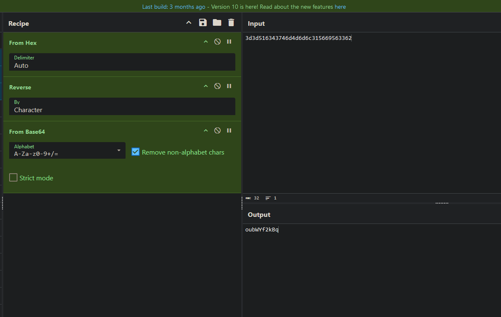

# Natas8 (Level 7 -> 8)

  * username: `natas8`  
  * password: `xcoXLmzMkoIP9D7hlgPlh9XD7OgLAe5Q`  
  * url: `http://natas8.natas.labs.overthewire.org`  
  * flag: `ZE1ck82lmdGIoErlhQgWND6j2Wzz6b6t`  
  * vulnerability: `Basic Reverse Engineering / Data Encoding/Decoding`  

## Proof of Concept

1. In order to solve this lab, I'm supposed to submit a specific `secret` passcode. Luckily, 
this challenge provides me with the source code, so I take a gander to gather any hints:  

2. From looking at the source code, I can see that it takes my user input and compares my input to a variable called `$encodedSecret`
3. It looks like the `secret` is provided in the source code, however it is `base64 encoded -> strrev -> bin2hex`. So to solve this challenge, I can take the value of `$encodedSecret` and reverse the recipe! I can use `cyberchef` to help me with this process:

4. I can use the decoded `secret` of `oubWYf2kBq` to solve the lab!  

