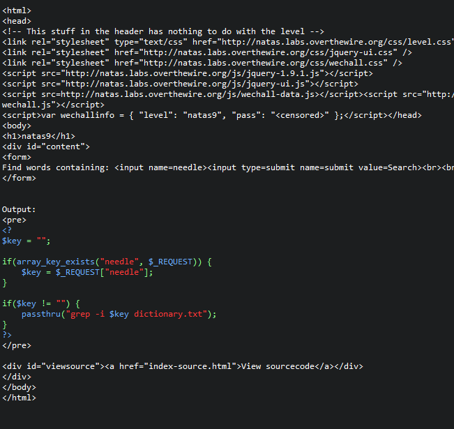
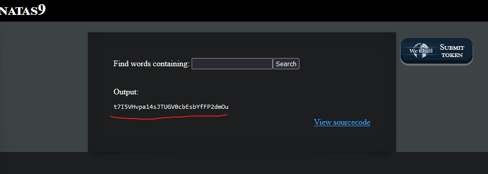

# Natas9 (Level 8 -> 9)

  * username: `natas9`  
  * password: `ZE1ck82lmdGIoErlhQgWND6j2Wzz6b6t`  
  * url: `http://natas9.natas.labs.overthewire.org`  
  * flag: `t7I5VHvpa14sJTUGV0cbEsbYfFP2dmOu`  
  * vulnerability: `Command Injection`  

## Proof of Concept
1. Start with reviewing the source code:  

2. From code review, I can see that the web application extracts the user's input data from  the variable `needle` in the `GET` request once the user clicks `search`. It uses the value of
`needle` in a PHP function called passthru() (`refer to notes`). With the passthru() function,
the web application uses the command-line command `grep -i $key dictionary.txt`
3. An important thing to note is that the web application does not validate or sanitize 
the user's input, so we can input a payload like: `; cat /etc/natas_webpass/natas10 #`  

## Notes
* `passthru()` is a function in PHP that executes external commands via the `command line` and outputs the raw results directly to the browser. 
* `grep` is a command-line utility that searches for specific patterns of text within files
  * `-i` is a flag option that specifies that the pattern is `case-insensitive`
  * General syntax: `grep "error" file.txt`
* `;` separates multiple commands so they can be executed sequentially, one after the other, regardless of whether the previous commaand **succeeds** or **fails**
* `#` indicates a comment in the shell. Anything following `#` is ignored by the shell. 
