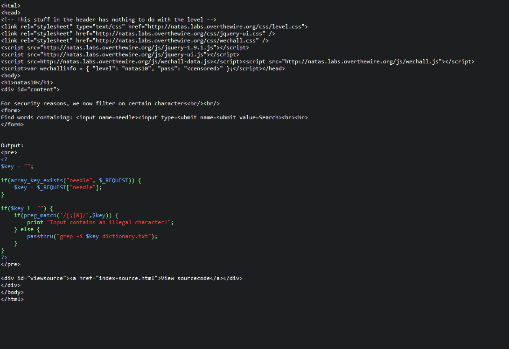
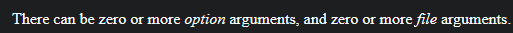
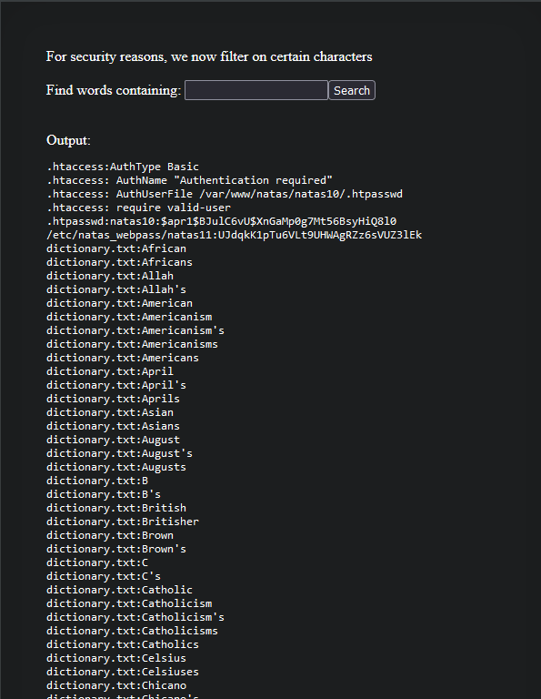
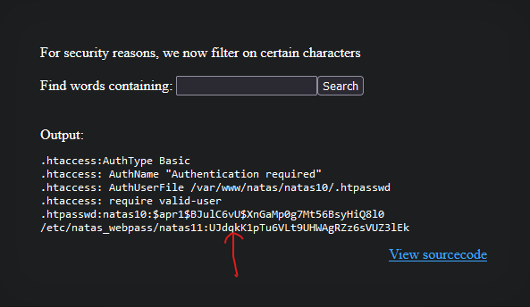

# Natas10 (Level 9 -> 10)

  * username: `natas10`  
  * password: `t7I5VHvpa14sJTUGV0cbEsbYfFP2dmOu`  
  * url: `http://natas10.natas.labs.overthewire.org`  
  * flag: `UJdqkK1pTu6VLt9UHWAgRZz6sVUZ3lEk`  
  * vulnerability: `Command Injection`  

## Proof of Concept
1. This excercise builds on the previous challenge (`natas09.md`), so please check it out as it contains useful
information! 
2. First, inspect the source code.  

3. The web application now checks for special characters (`;, |, &`) and will not run if the user input if it contains
any of the mentioned special characters. This is a useful security feature, however there is still a flaw. 
4. After reading the documentation on grep, `grep` is not confined to searching one file or directory. You can
chain multiple files/directories within the same command:  

5. Using this information, as well as knowing that these Natas challenges always keeps the password within the 
directory `/etc/natas_webpass/`, I can input: `.* /etc/natas_webpass/natas11`. This input will search for anything 
within both `/etc/natas_webpass/natas11` and `dictionary.txt`:  

6. The output now displays many pieces of text and data, but the list is extremely long to parse through on our own.
Another vulnerability that the `security update` that the web application has is that it doesn't sanitize the user 
input for `#`, which is a single line comment. So, now I can update my payload to: `.* /etc/natas_webpass/natas11 #`
so `grep` looks for everything and anything in `/etc/natas_webpass/natas11` and not in dictionary.txt   

7. Now it's extremely easy for me to point out the password for natas11, which is `UJdqkK1pTu6VLt9UHWAgRZz6sVUZ3lEk`
## Notes
* For regex patterns: 
  * `*`- must follow something. It repeats the thing before it zero or more times. 
    * For example: `a*` matches `a`, `aa`, etc. 
  * `.`- matches any single character (like a, b, c, d, 1, $, etc.)  

You can combine these two patterns so it matches the 'name' of anything! 
