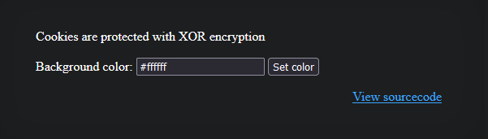
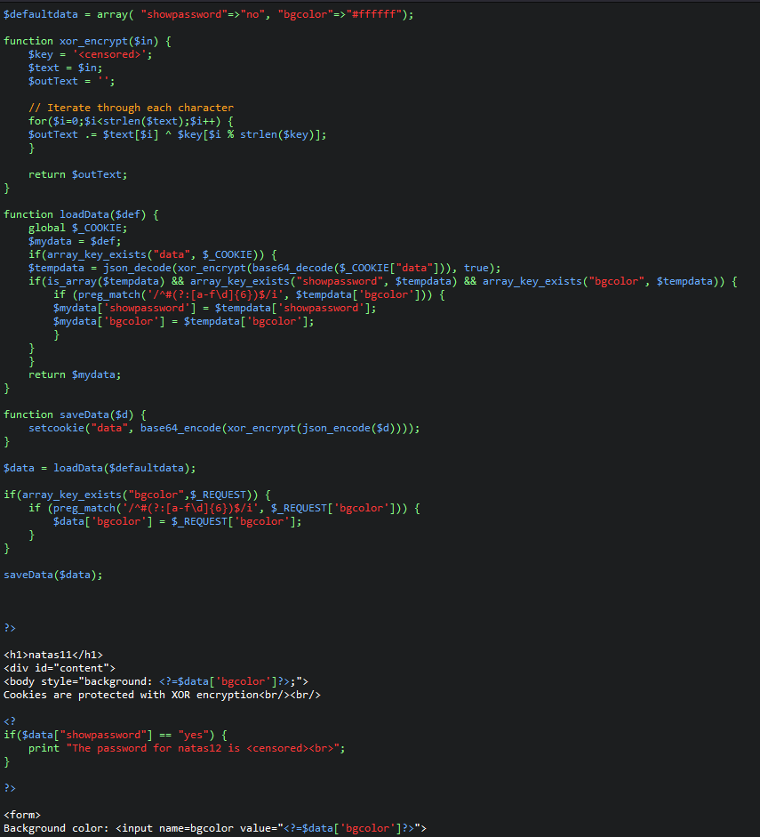
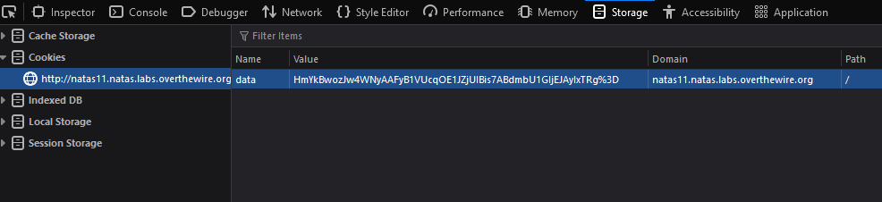
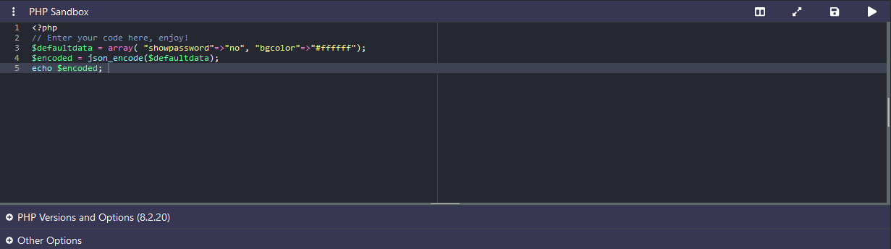
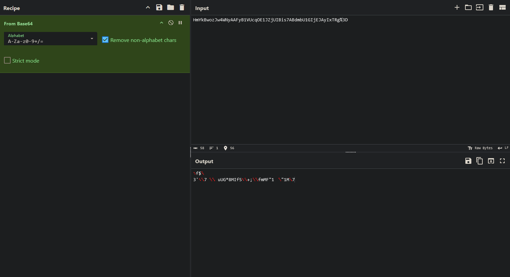
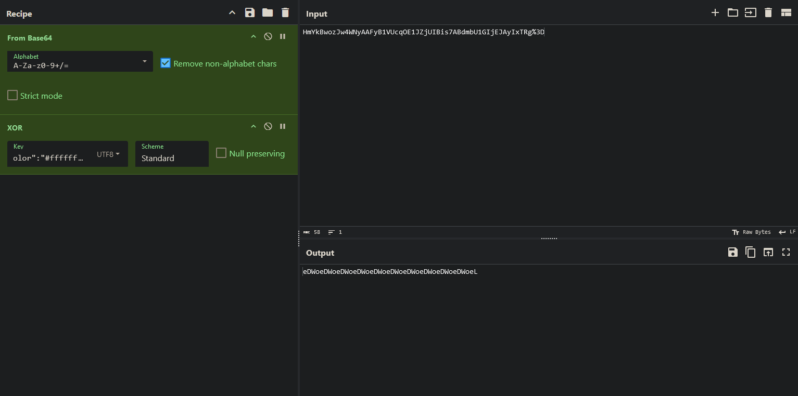
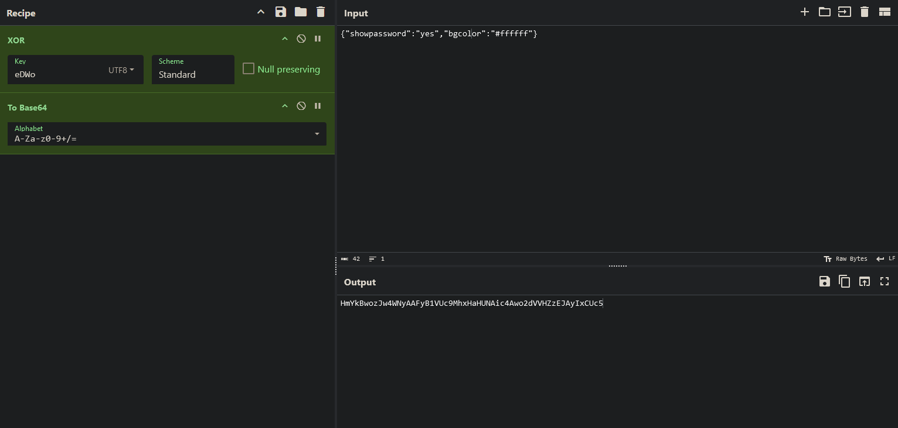
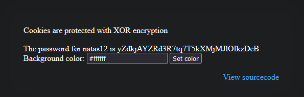

# Natas11 (Level 10 -> 11)

  * username: `natas11`  
  * password: `UJdqkK1pTu6VLt9UHWAgRZz6sVUZ3lEk`  
  * url: `http://natas11.natas.labs.overthewire.org`  
  * flag: `yZdkjAYZRd3R7tq7T5kXMjMJlOIkzDeB`  
  * vulnerability: `Reverse Engineering and Cookie Manipulation`  

## Proof of Concept
1. I see a web application that expects the user to input a hex-code to change the background color of the web application. I also see a useful hint: `Cookies are protected with XOR encryption.`  

2. From the hint, I'm assuming the challenge in this lab is to bypass the security measures and manipulate the cookies in some sense. Let's take a look at the `source code` and the `cookie` to see how exactly the web application processes cookies and XOR encryption.   
  

3. From code review, I see that it takes the current `cookie` named `data` from the web application, decodes it from base64, performs XOR encryption on it, then JSON decodes it. I also see there is a pre-existing `defaultdata` that the code has: `$defaultdata = array( "showpassword"=>"no", "bgcolor"=>"#ffffff");` it uses this pre-existing default data and sets it as `$mydata` within the `loaddata()` function. It then sets the decoded cookie's values to the values of the `$mydata`. So, my guess is that the cookie, when decoded has the same or similar structure of `$defaultdata = array( "showpassword"=>"no", "bgcolor"=>"#ffffff");` and if I manage to to change the value of `showpassword` to `yes` and encode it back and set that as the web application's new cookie, I should be able to solve the lab. 
> An important thing to note is that within the `loadData()` function, the web application takes the cookie value performs multiple operations on it, then it checks to see if it's an array, if it has an array key of `showpassword` and if there's another array key of `bgcolor`. This format is the exact same as seen in `$defaultdata` in the beginning of the source code. 

4.  An interesting thing to note is that `$defaultdata = array( "showpassword"=>"no", "bgcolor"=>"#ffffff");` is PHP code. And if you look through the source code, when the web application `loads` and `saves` data, it performs JSON encoding and decoding. So, I can safely assume that the clear text value for this XOR encryption is the JSON version of `$defaultdata = array( "showpassword"=>"no", "bgcolor"=>"#ffffff");`. To convert this into JSON, I can open up a PHP compiler online like `onlinephp.io` and enter the following code:   

5. This gives me the `plaintext` value of `{"showpassword":"no","bgcolor":"#ffffff"}`. Now, I can `XOR` this in `CyberChef` with the `ciphertext` to get the `key`. But, what is the `ciphertext`? Good question! From the `loadData()` function in the source code, I can see that the web application takes the `data` cookie and and `base64_decodes` it before performing an `XOR` encryption operation. So let's do that operation in `CyberChef`:   

6. If you look in the output, it gives us weird looking text that is not understandable. However, if we assume that this is the `ciphertext` and perform an `XOR` operation on it with our `plaintext` value of `{"showpassword":"no","bgcolor":"#ffffff"}`, we will see something truly beautiful.    

7. What we see is the repeating sequence of: `eDWo` over and over again. However this is perfect because we now know that the key is `eDWo`, because the `key` in `XOR encryption` typically repeats itself to cover the full length of whatever it is trying to encrypt. 
8. Now, we can create our own data like: `{"showpassword":"yes","bgcolor":"#ffffff"}` (`note how i changed the value of showpassword`). And we can now follow the logic of the web application to "save" this data using the operations listed in the `saveData` function, which is `json_encode` -> `xor_encrypt` -> `base64_encode`
> I already performed `json_encode` because our data is in json format! So we can start with `xor_encrypt`, with the key: `eDWo`. 

  
9. Now I can use the output (`which is my new cookie`) and replace the old cookie in the browser's dev tools, and reload the page!  

## Notes
* `XOR encryption` is a simple encryption method that uses the XOR (`exclusive OR`) logical operation to combine 
plaintext with a key, producing cipher text. 
  * It works by comparing each bit of the plaintext with the corresponding bit of the key using the XOR operation, which outputs `1` if the bits are `different` and `0` if they are the same. 
  * The resulting sequence is `ciphertext`. To decrept, the same `XOR operation is applied between the ciphertext
  and the key, as XOR is `reversible`. 
> There is a vulnerable spot when it comes to `XOR encryption`. If you have any of the 2 from the list of 3: `plaintext`, `ciphertext`, `key` you can determine the last `unknown` factor. For instance, if you know the `plaintext` and the `ciphertext`, you can perform `XOR encryption` on those two factors to determine the `key`. 
