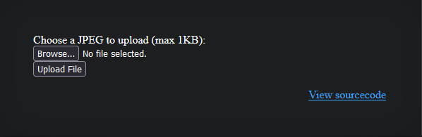
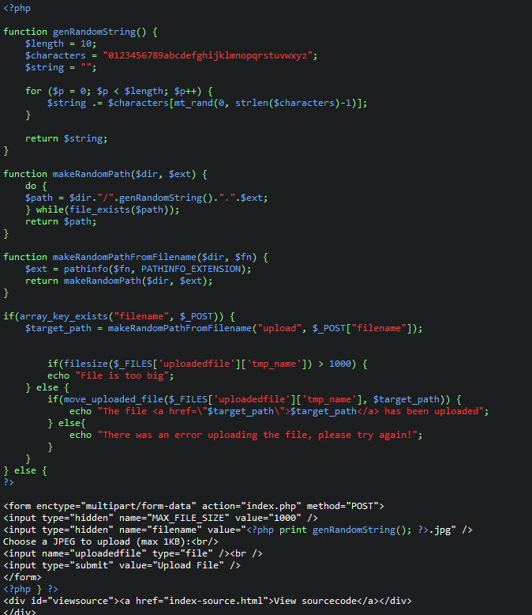
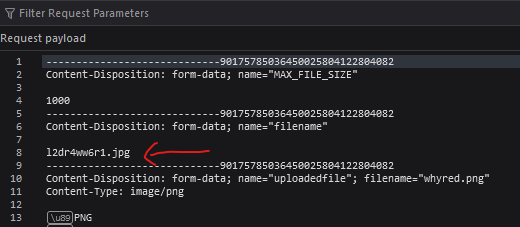
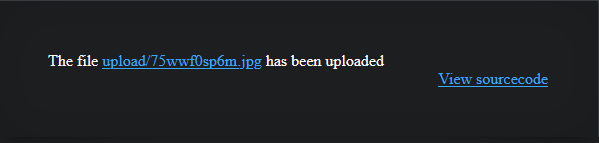
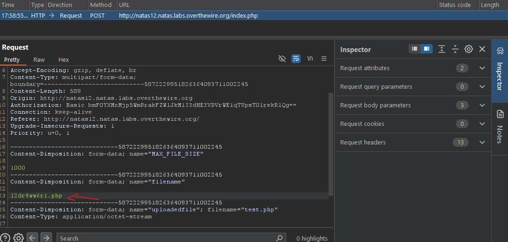
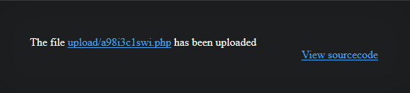
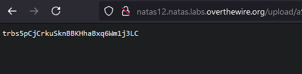

# Natas12 (Level 11 -> 12)

  * username: `natas12`  
  * password: `yZdkjAYZRd3R7tq7T5kXMjMJlOIkzDeB`  
  * url: `http://natas12.natas.labs.overthewire.org`  
  * flag: `trbs5pCjCrkuSknBBKHhaBxq6Wm1j3LC`  
  * vulnerability: `Client-Side Validation Bypass / File Upload Vulnerability`  

## Proof of Concept
1. This web application seems to take user input, where the user uploads a JPEG file. Note that on the home page,
it states that the JPEG file should be `1KB` max. So I'm assuming it validates the size of the file that the user 
uploads.  

2. I know that the web application validates file size, but does it validate the type of file I upload? Rather 
than testing this manually, thankfully `Natas` provides source code, so we can perform `code review` and determine 
exactly what the web application does.   

3. From simple code review, I'm able to deduce:  
* **Handling `filename` in POST**: The code checks if the filename key exists in the `$_POST` array. If present, 
it proceeds to handle the file upload process. 
* **Extracting the File Extension**: 
  * The `pathinfo()` function is used to extract the file extension from the uploaded filename (`$_POST["filename"]`)
  * This extension is sued to generate a random file path via `makeRandomPathFromFilename()`
* **Random Path Generation**
  * A random string is generated using `genRandomString()` function 
  * The `makeRandomPath()` function ensures taht the generated path does not already exist
* **File Size Check**
  * The file size of the uploaded temporary file is checked, and an error message is displayed if it exceeds 1KB 
* **Moving the File**
  * If the file is within the size limit, it is moved to the generated random path using `move_uploaded_file()`
  * Success or failure is reported to the user accordingly 
* **Form Logic**
  * If not file is uploaded (i.e. `filename` is not in `$_POST`), the form is displayed
  * The form includes an automatically generated random filename with a `.jpg` extension. 
> It's important to note that the web application does not check for the the type of file uploaded, and will always 
change the extension to `.jpg`. This is dangerous, as user input is not properly sanitized. 

4. I tried uploading a dummy .png file to study how the web application would process it. I see that my code review 
from the previous step was correct. It creates a a new (randomly generated name) for my file and changes the file 
extension to `.jpg`.   

5. I created a simple `test.php` file with the following code and uploaded it through the web application. It looks like my file was small enough to get past validation!: 
```
<?php
    echo '<pre>';
        // passthru("cd /etc/natas_webpass/; ls -l;"); 
        passthru("cat /etc/natas_webpass/natas12"); 
    echo '</pre>'; 
?>
```
  
6. I can now click on the link and trigger my php script. However, when I click on the link it states that the `path` (the link) cannot be displayed because it contains errors. This could be because the web application expected to see a `.jpg` file but it contains `.php` code. So, to bypass this `client-side` .jpg naming feature, you can use a proxy (`like Burp Suite`) to intercept the request and change `.jpg` to `.php`.  
  
7. Now I can forward this request from Burp Suite with the altered extension name and you can see that the it successfully changed the file extension from `.jpg` to `.php`. Using proxies as a `middleman` to bypass 
client-side authentication and filters is extremely powerful! Now I can click on this link and trigger my custom `PHP` script.   
  


## Notes
* `pathinfo()` is a function in PHP that returns information about a file path, such as `directory name`, `base name`,
`file name`, `extension` in the form of an `associative array`. The general syntax is: 
  * `pathinfo(string $path, $flags)`: $flags is a constant specifying which part of the `path to return`
