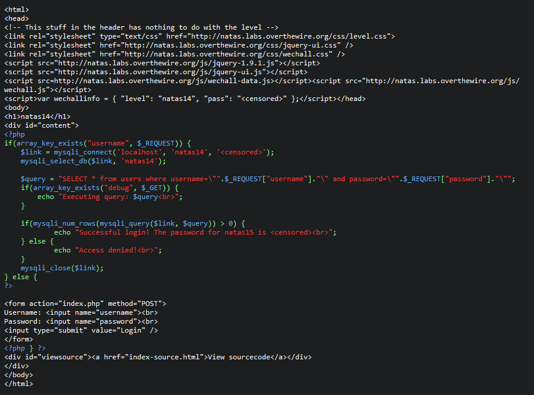
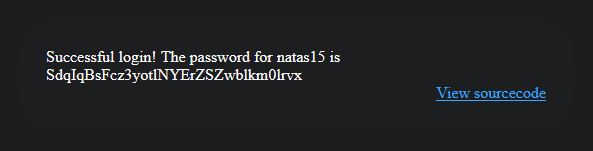

# Natas14 (Level 13 -> 14)

  * username: `natas14`  
  * password: `z3UYcr4v4uBpeX8f7EZbMHlzK4UR2XtQ`  
  * url: `http://natas14.natas.labs.overthewire.org`  
  * flag: `SdqIqBsFcz3yotlNYErZSZwblkm0lrvx`  
  * vulnerability: `SQL Injection`  

## Proof of Concept
1. On the home page of the challenge, I see a login form. It seems to be a lab on `sql injections`, because websites normally utilize databases to authenticate users. 
Let's take a look at source code.  

2. From analyzing the source code here is my analysis:  
  * **User Input**: The web app takes user inputs for `username` and `password` via a form. 
  * **Request Handling**: It checks if the `username` key exists in the incoming HTTP request (`$_REQUEST` includes GET, POST, and COOKIE data). 
    * If `username` exists, it proceeds to connect to the database
  * **Database Connection**: It connects to a local MySQL database using hardcoded credentials 
  * **SQL Query Construction**: It constructs a SQL directly using user inputs 
    * If `debug` is set in the GET parameters (appending `?debug=yes` in the URL before submitting the form), it echoes the SQL query to the page
  * **SQL Query Execution**: 
    * It executes the SQL query on the database.
    * If the query returns any rows (via `mysqli_num_rows`), it considers the login successful and displays the password for the next level.
    * Otherwise, it denies access.
3. There is one glaring security issue. The code is vulnerable to SQL injection because it directly uses `unsanitized` user input in the SQL query. 
A malicious actor could manipulate the `username` or `password` input to subvert the logic of the query and bypass authentication. 
For instance, if I input `test" OR 1=1-- -` for the `username` this alters the query to look like:  

```SQL
SELECT * from users where username = "test" OR 1=1 -- - and password = "test";
```
My injection changes the query to where it returns rows whether there is a user named "test" (which there is not probably) `OR` if 1=1 (which it is). 
This subverts the original logic of the query and will return rows from the database, hence logging me in! 


## Notes 
- `-- -` is a single-line comment in SQL 
