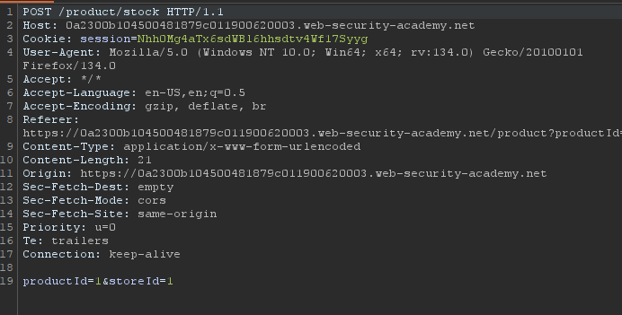
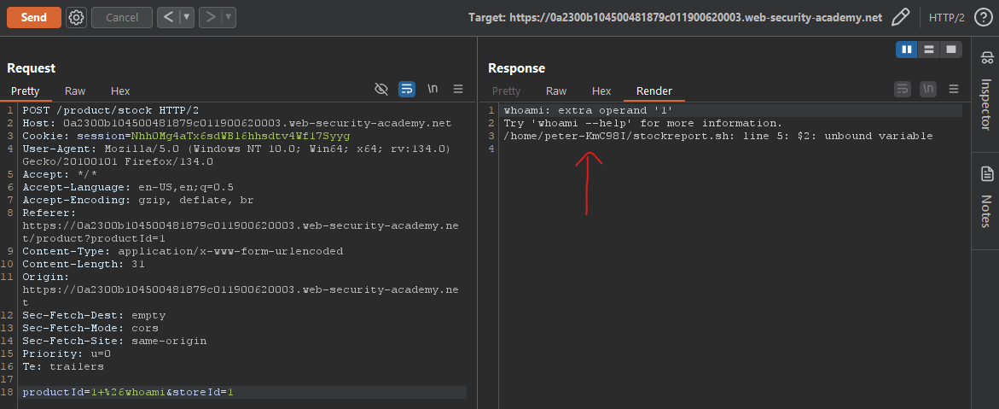
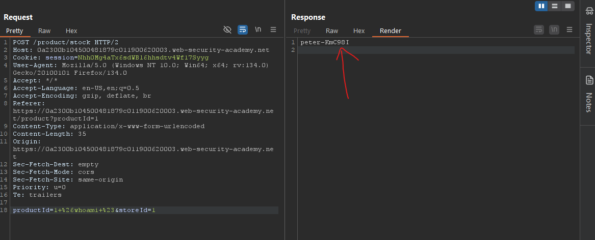

# Lab01: OS command injection, simple case
* url: `https://portswigger.net/web-security/os-command-injection/lab-simple`
* vulnerability: `OS Command Injection`

## Description 
This lab contains an OS command injection vulnerability in the `product stock checker`.

The application executes a `shell command` containing user-supplied product and store IDs, and returns the raw output from the command in its response.

To solve the lab, execute the whoami command to determine the name of the current user. 

## Proof of Concept
1. Navigate and click on any of the listed products on the home page on their respective `View details` buttons. 
2. You will see that after clicking on `view details` the web application has a functionality to `check stock`. 
From the description of the lab, I know that the web application executes a `shell command`. I can trigger the 
execution and intercept the request on `Burp Suite` to see what is going on:  

3. I can see that it takes two parameters `productID=1` and `storeId`. From playing around with the web application, the productID is dependent on which product you choose from the homepage and the storeID is dependent on which location you choose. 
4. Let's test each parameter if they are vulnerable to command injection. To do this, I send the intercepted request to `repeater` within Burp Suite. Let's test the `productId` variable by injecting ` &whoami`    

5. We generate an error explaining that the server tried the `whoami` command, which triggered an `unbound variable` error. The reason behind this is probably we injected a command and the original os command on the backend takes in and expects more variables. This would ruin the logic of the original command. To get around this, I can change me injection to ` &whoami # `. The `#` is used in bash as a comment character, which will comment out the rest of the original command on the backend.  

