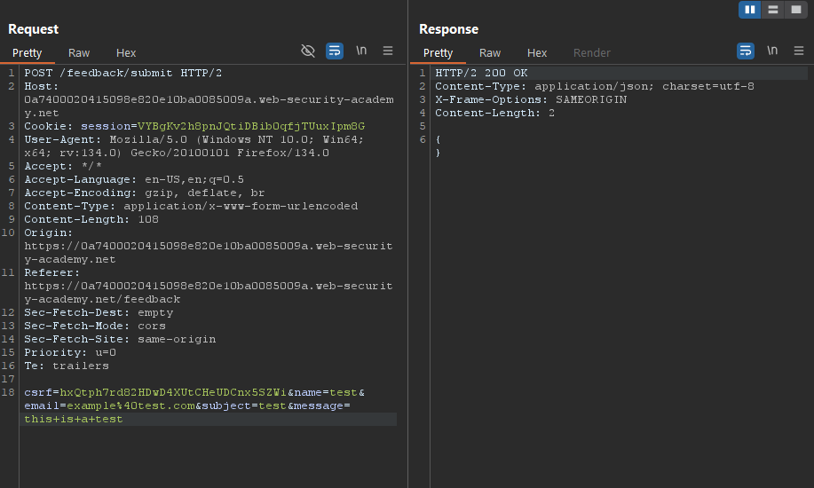

# Lab02: Blind OS command injection with time delays
* url: `https://portswigger.net/web-security/os-command-injection/lab-blind-time-delays`
* vulnerability: `Blind OS Command Injection`

## Description 
This lab contains a blind OS command injection vulnerability in the `feedback function`.

The application executes a shell command containing the user-supplied details. The output from the command is `not returned` in the response.

To solve the lab, exploit the blind OS command injection vulnerability to cause a 10 second delay. 

## Proof of Concept
1. I'm told that the `feedback function` of the web application. So I navigate to the `Submit Feedback` hyperlink on the homepage and I see a form that takes user input: `name`, `email`, `subject`, and `message`. Judging from this, I can assume that because the web application executes an OS command, it might be using something like `mail` or `mailx`: 
```php
<?php
if ($_SERVER["REQUEST_METHOD"] == "POST") {
    $name = $_POST["name"];
    $email = $_POST["email"];
    $feedback = $_POST["feedback"];
    
    // Compose the email body
    $body = "User Feedback:\n\n";
    $body .= "Name: $name\n";
    $body .= "Email: $email\n";
    $body .= "Feedback:\n$feedback\n";
    
    // Use the mail command to send the email
    $subject = "User Feedback from $name";
    $recipient = "admin@example.com"; // The admin's email

    // Send the email via command line
    $command = "echo '$body' | mail -s '$subject' $recipient";
    exec($command);
}
?>
```
2. Keep in mind that the code snippet above is just an `educated guess`, because I don't have access to the source code. However, it's good to have a general idea of what the source code could look like in order to form my `payloads`. First, let's send dummy data and `intercept the request` in Burp Suite, then send that request to `repeater` for testing:   

3. Take note of the how there is no `distinct response` from the webserver when I send/forward the request through Burp Suite. Despite not having a response from the webserver, I can still test each parameter for a `command injection` vulnerability by utilizing the `sleep` os command: 
```bash
sleep [OPTION] DURATION

sleep 5 #sleeps for 5 seconds
```
4. I first start with the first parameter, which is `name`. The payloads I will use for testing of each parameter will be ` & sleep 5 # `. 
> Don't forget to URL encode your payloads! 

5. I found that the `email` parameter is vulnerable to `OS command injection` because I received a response from the web server approx 5 seconds after i sent the request!
