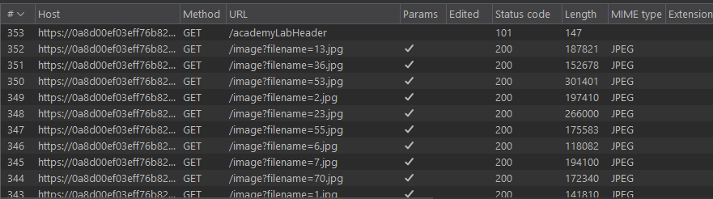
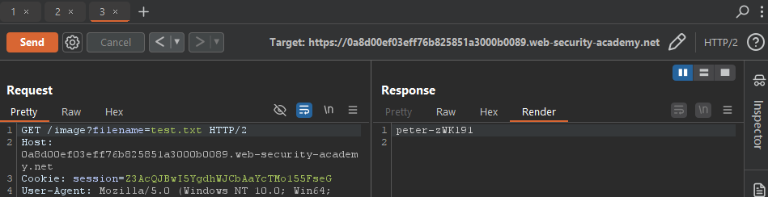

# Lab03: Blind OS command injection with time delays
* url: `https://portswigger.net/web-security/os-command-injection/lab-blind-output-redirection`
* vulnerability: `Blind OS Command Injection`

## Description 
This lab contains a blind OS command injection vulnerability in the `feedback function`.

The application executes a shell command containing the user-supplied details. The output from the command is not returned in the response. However, you can use output redirection to capture the output from the command. There is a `writable folder` at: 
> /var/www/images/

The application serves the images for the product catalog from this location. You can redirect the output from the injected command to a file in this folder, and then use the image loading URL to retrieve the contents of the file.

To solve the lab, execute the `whoami` command and retrieve the output. 

## Proof of Concept
1. This lab introduces the concept of extracting data from a blind os command vulnerability. In the description, it states that the `feedback function` is vulnerable, so I can test each parameter for vulnerabilities by utilizing the `sleep` function- just like in the prior lab. 
2. From testing each parameter, I see that the `email` parameter is still the vulnerable parameter. 
3. Now I can exploit it by using the payload: ` & whoami > /var/www/images/test.txt #`
4. To check if the command worked, go to burp suite's http history and enable images from the filter, and you should see many http requests containing `/image?filename...`. Many sites utilize image folders (from the webroot) in order to pull images for the webapplication. I can exploit this by sending one of the listed requests and changing the `image?filename=test.txt`  
  
  

## Notes
* **Overwrite or Create File**(`>`): Redirects the output of a file, overwriting is if the file already exists. 
```bash
command > /path/to/directory/filename.txt
```

