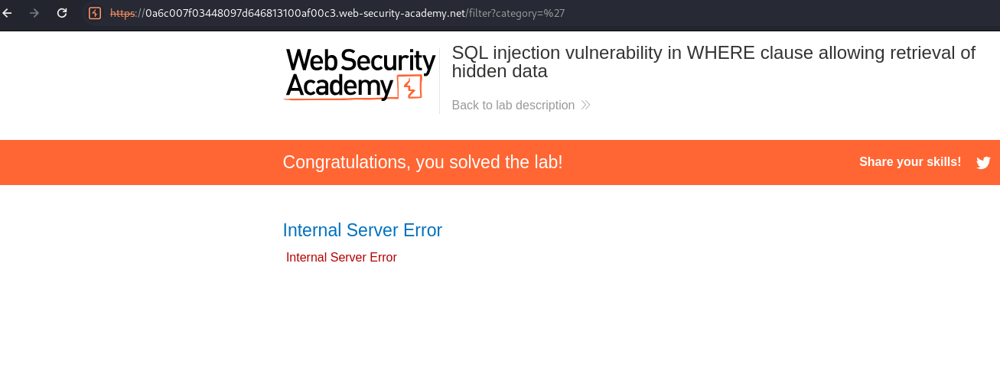
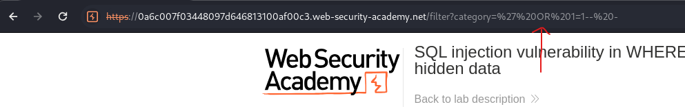

# Lab01: SQL injection vulnerability in WHERE clause allowing retrieval of hidden data
* url: `https://portswigger.net/web-security/sql-injection/lab-retrieve-hidden-data`
* vulnerability: `SQL injection`

## Description
This lab contains a SQL injection vulnerability in the `product category filter`. When the user selects a category, the application carries out a SQL query like the following:

> SELECT * FROM products WHERE category = 'Gifts' AND released = 1

To solve the lab, perform a SQL injection attack that causes the application to display one or more unreleased products.

## Proof of Concept
1. I navigate to the `Pets` category and change the `category` parameter in the url to **`** in order to check for sqli. As you can see here, I triggered an `internal server error`:  

2. Then, I change `category` parameter value to **` OR 1=1 -- -** in order to break out of the current SQL query statement and to return all products, even unreleased products. This will solve the lab!:  

