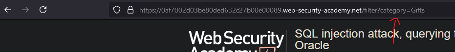
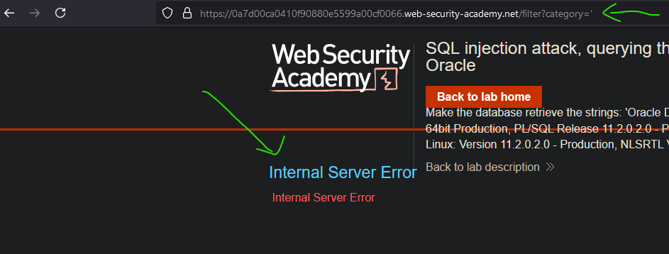
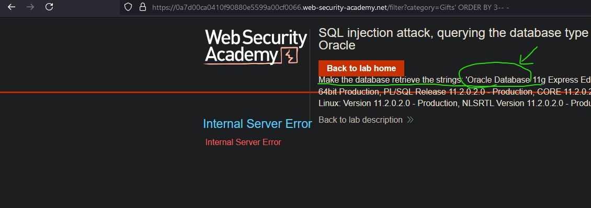

# Lab01: SQL injection attack, querying the database type and version on Oracle
* url: `https://portswigger.net/web-security/sql-injection/examining-the-database/lab-querying-database-version-oracle`
* vulnerability: `Union-Based SQL Injection`

## Description 
This lab contains a SQL injection vulnerability in the product category filter. You can use a UNION attack to retrieve the results from an injected query.

To solve the lab, display the database version string. 

## Proof of Concept
1. By clicking on any of the shown hyperlinks on the home page of this lab, I can observe that the URL changes, specifically the parameter `category`. For example, if I click on the "Gifts" hyperlink, the URL changes to `...?category=Gifts`:  

2. To get an idea if the web application is vulnerable to SQLi, I tried changing the value of `category` to `'`. This triggered an error on the backend of this web app, so it looks promising:  

3. Judging from the prompt of this lab, I'm supposed to use a `UNION` attack. However, for UNION-based SQLi payloads, I must keep two things in mind:  
* The number of columns used in the original SQL statement must match the select statement I'm appending with the UNION keyword. 
* The data types of the corresponding columns must match. 
4. In order to see how many columns of data that the original SQL statement uses, I can utilize `ORDER BY` and increment the number until I reach an error. It looks like I reached an error when I used this payload -> `' ORDER BY 3-- -`:  
> When you test from `' ORDER BY 1-- -` to `' ORDER BY 2-- -`, note how the content changes!

  
5. In the previous step, because I experienced an error by using `' ORDER BY 3-- -`, I can deduce that the number of columns of the original SQL statement is `2`. Now that we know the correct number of columns, we can start building our UNION-based payload: `' UNION SELECT ...`
6. In order to solve this lab, it seems like I need to be able to output the database version, however- I don't know the type of database it is. So, I can try different payloads and see which one works: 
* MySQL: `SELECT VERSION();` or `SELECT @@version`
* PostgreSQL: `version();`
* Microsoft SQL Server: `SELECT @@version`
* Oracle: `SELECT version from v$instance;` or `select banner from v$version` or 
`SELECT * from v$version;`
* SQLite: `SELECT sqlite_version();`
7. In a blind-case scenario, I would have to try each of the payloads, however this lab gives me a hint:  

8. So, I reloaded the page, intercepted the request with Burp Suite, and used the payload: `'+UNION+SELECT+banner,+null+FROM+v$version--+-` in order to solve the lab!

## Notes
* `ORDER BY` is used to sort the result set of a query by one or more columns, either in ascending or descending order.
