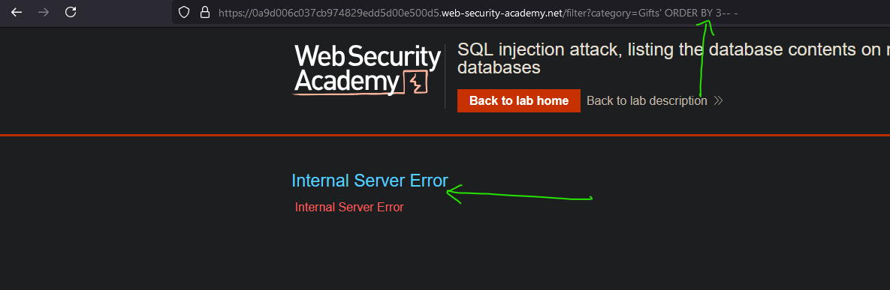
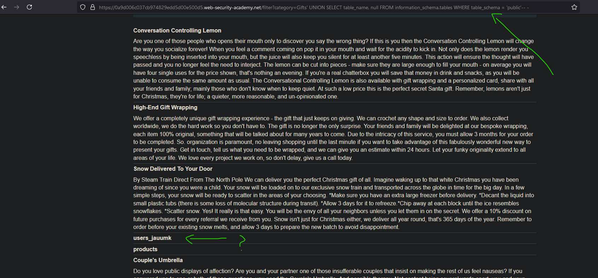
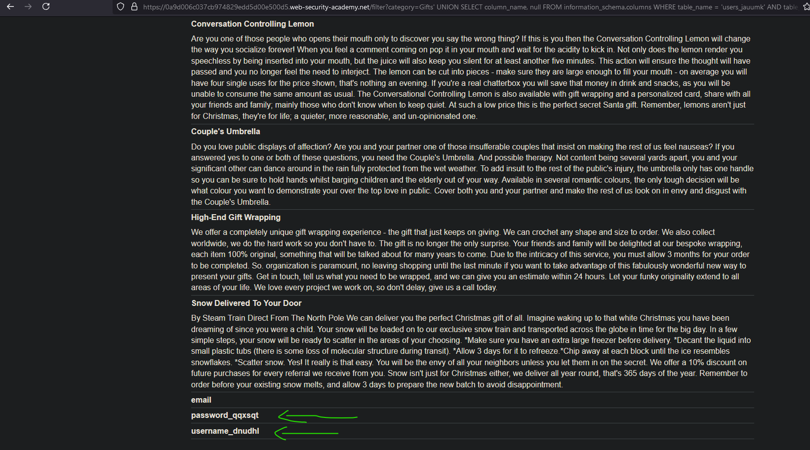
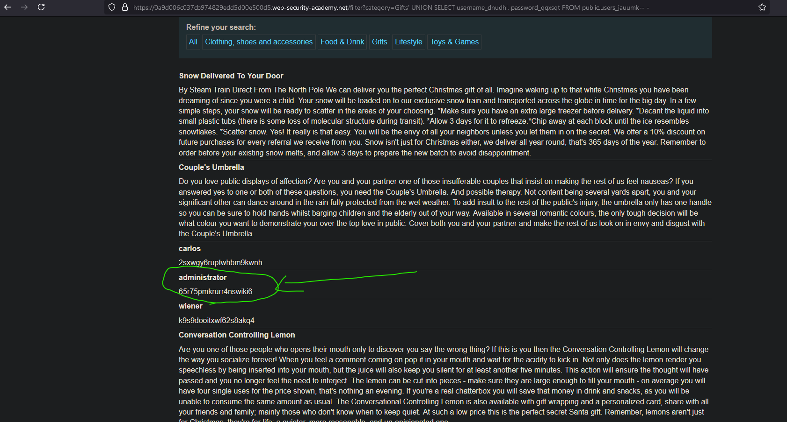
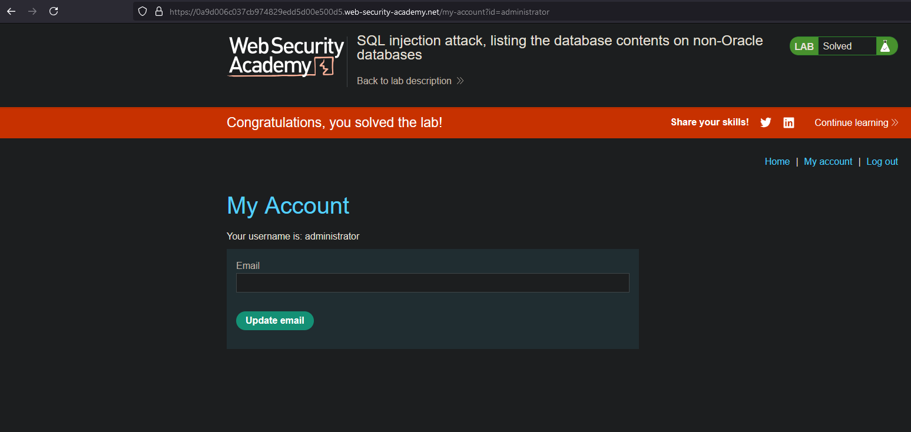

# Lab03: SQL injection attack, listing the database contents on non-Oracle databases
* url: `https://portswigger.net/web-security/sql-injection/examining-the-database/lab-listing-database-contents-non-oracle`
* vulnerability: `Union-Based SQL Injection`

## Description 
This lab contains a SQL injection vulnerability in the product category filter. The results from the query are returned in the application's response so you can use a UNION attack to retrieve data from other tables.

The application has a login function, and the database contains a table that holds usernames and passwords. You need to determine the name of this table and the columns it contains, then retrieve the contents of the table to obtain the username and password of all users.

To solve the lab, log in as the administrator user. 

## Proof of Concept
1. From both the title and description of this lab, I can deduce that
I will have to use a `Union` payload in order to extract the database contents
of the web application's DBMS, specifically the `table` that contains `usernames`
and `passwords`. And once I gain access to the usernames and their corresponding passwords,
I should log in as the `administrator` user to solve the lab. 
2. Because I know that the `product category filter` is vulnerable to SQLi, I can click on
any of the links for my point of injection. I chose to use `...?category=Gifts`. 
3. I need to check how many columns of data are being retrieved from the backend, so I will
will append `' ORDER BY X-- -`, to the end of the URL. (X will start at 1, and I will increment
until I dont see an error.) I face an error when my payload is `' ORDER BY 3-- -`, so I can 
deduce that the columns I need is 2:  

4. Now I can start crafting my `UNION` payload. I can start it off with:
`' UNION SELECT schema_name, null FROM information_schema.schemata-- -`. This will give me a list of the 
database names:  

5. I'm interested in the `public` database, so I will dig a little deeper with the following 
payload: `' UNION SELECT table_name, null FROM information_schema.tables WHERE table_schema ='public'-- -`:  

6. The `users_jauumk` table from the `public` database looks different, so let's take a look at its columns. Payload: `' UNION SELECT column_name, null FROM information_schema.columns WHERE table_name = 'users_jauumk' AND table_schema = 'public'-- -`  

7. From the previous output, I see column names of `password_qqxsqt` and `username_dnudhl`. It looks like I'm getting very close! I can check for the contents of the two columns using:  
`' UNION SELECT username_dnudhl, password_qqxsqt FROM public.users_jauumk-- -`:  

8. In the output, it looks like the user is `administrator` and the password is `65r75pmkrurr4nswiki6`, so I can go ahead and test if these credentials work in the login page!  

## Notes
* `information_schema` is a read-only database within a DBMS that provides `metadata` about the 
database. 
  * `information_schema`: 
    * `.schemata`: information about all databases in the system
      * Key columns: `schema_name`
    * `.tables`: details about all tables in the database
      * Key columns: `table_schema`, `table_name`, `table_type`
    * `.columns`: Information about all columns in every table 
      * Key columns: `table_schema`, `table_name`, `column_name`, `data_type`
    * `.user_privileges`: Shows user privileges granted at the global level
      * Key columns: `grantee`, `privilege type`
> Most relational database systems refer to `schema_name` as the `database name`. 
> `table_schema` represents the `database name` where the table exists

