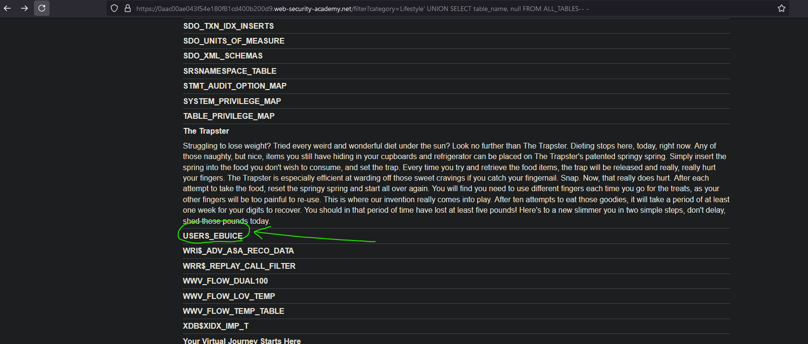
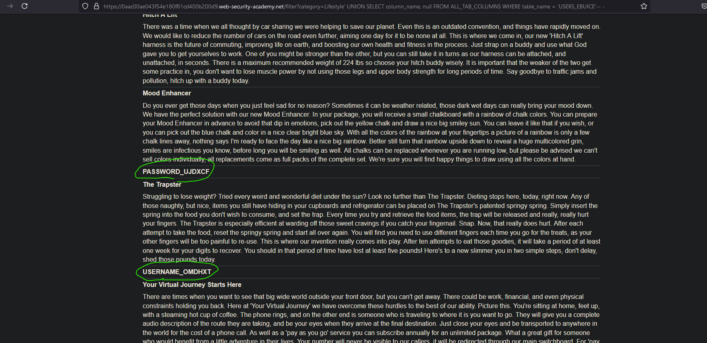
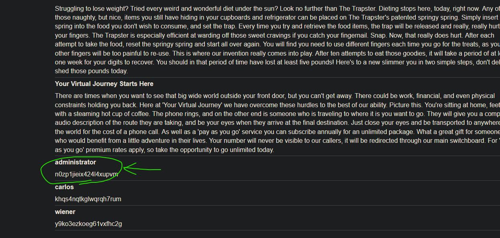
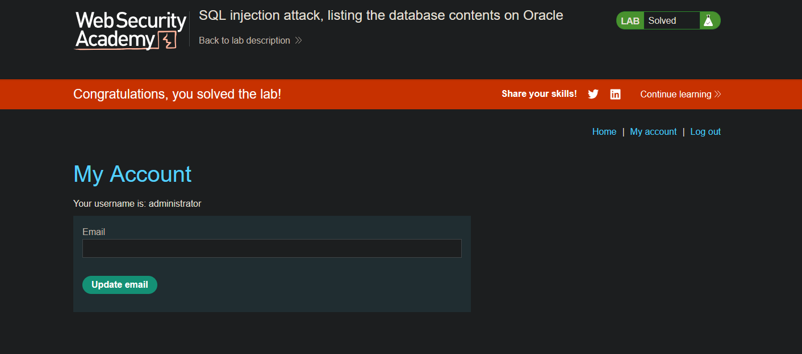

# Lab04: SQL injection attack, listing the database contents on Oracle
* url: `https://portswigger.net/web-security/sql-injection/examining-the-database/lab-listing-database-contents-oracle`
* vulnerability: `Union-Based SQL Injection`

## Description 
This lab contains a SQL injection vulnerability in the product category filter. The results from the query are returned in the application's response so you can use a UNION attack to retrieve data from other tables.

The application has a login function, and the database contains a table that holds usernames and passwords. You need to determine the name of this table and the columns it contains, then retrieve the contents of the table to obtain the username and password of all users.

To solve the lab, log in as the administrator user. 

## Proof of Concept
1. The methology behind this lab is very close to `sqli-practitioner-lab03.md`, so please 
check it out as I may leave out some crucial or helpful steps and tips. 
2. I'm told that the product category filter is vulnerable to SQLi, and that I must gain 
access to a users table to get the credentials for the `administrator` user. However, unlike
lab03, the database version I am going to attempt to hack into is `Oracle`, which uses different
methology from the usual information_schema. Please refer to the notes section for equivalencies!
3. I start by checking the number of columns the backend query has using the following payload:
`' ORDER BY X-- -` (X starts from 1, keep incrementing till error):  

4. Now that I know the number of columns I need is `2`, I can start my UNION attack. I start 
by enumerating the tables accessible to the current user (me):
`' UNION SELECT table_name, null FROM ALL_TABLES-- -`  

5. From the output, one table stood out to me: `USERS_EBUICE`, so I decide to dig deeper:
`' UNION SELECT column_name, null FROM ALL_TAB_COLUMNS WHERE table_name = 'USERS_EBUICE'-- -`  

6. From the previous output, I see two juicy columns: `PASSWORD_UJDXCF` and `USERNAME_OMDHXT`
I can now tailor my payload to extract data from the `USERS_EBUICE` table using:
`' UNION SELECT USERNAME_OMDHXT, PASSWORD_UJDXCF FROM USERS_EBUICE-- -`  

7. Now I can use the `administrator` credentials in order to log in and solve the lab!  

## Notes
* For enumerating `Oracle` databases: 
  * `information_schema.schemata equivalency`: 
    * `DBA_USERS`: Lists all users (schemas) in the database (requires DBA privileges)
    * `ALL_USERS`: Lists all users (schemas) accessible to the current user 
    * `USER_USERS`: Contains information about the current user's schema
      * Key Columns: `username` (schema name)
  * `information_schema.tables equivalency`: 
    * `DBA_TABLES`: Lists all tables in the database (requires DBA privileges)
    * `ALL_TABLES`: Lists all tables accessible to the current user
    * `USER_TABLES`: Lists all tables owned by the current user
      * Key Columns: `owner`, `table_name`, `table_type`
  * `information_schema.columns equivalency`: 
    * `DBA_TAB_COLUMNS`: Contains information about all columns in all table in the database (requires DBA privileges)
    * `ALL_TAB_COLUMNS`: Contains information about all columns in tables accessible to the current user
    * `USER_TAB_COLUMNS`: Contains information about all columns in tables owned by the current user
      * Key columns: `owner`, `table_name`, `column_name`, `data_type`
  * `information_schema.user_privileges equivalency`
    * `DBA_TAB_PRIVS`: Contains information about table privileges granted to users
    * `ALL_TAB_PRIVS`: Contains information about table privileges granted on tables accessible to the current user
    * `USER_TABLE_PRIVS`: Contains information about table privileges granted on tables owned by the current user
      * Key columns: `grantee`, `privilege`

> To check if you're a DBA on an Oracle database you can run the following queries: 
`SELECT * FROM USER_ROLE_PRIVS WHERE granted_role = 'DBA'; `
`SELECT username, granted_role, admin_option FROM USER_ROLE_PRIVS WHERE granted_role = 'DBA';`
`SELECT * FROM USER_SYS_PRIVS WHERE privilege LIKE '%DBA%';`

