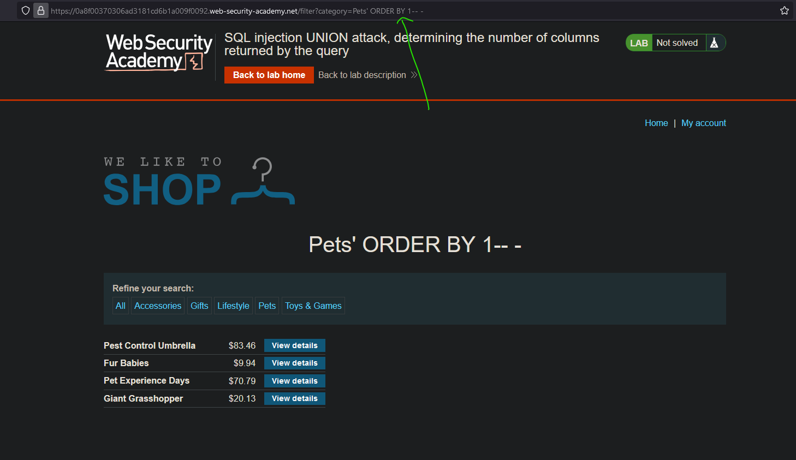
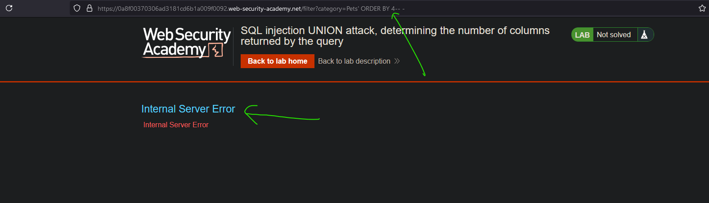
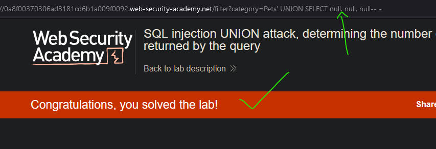

# Lab05: SQL injection UNION attack, determining the number of columns returned by the query
* url: `https://portswigger.net/web-security/sql-injection/union-attacks/lab-determine-number-of-columns`
* vulnerability: `Union-Based SQL Injection`

## Description 
This lab contains a SQL injection vulnerability in the product category filter. The results from the query are returned in the application's response, so you can use a UNION attack to retrieve data from other tables. The first step of such an attack is to determine the number of columns that are being returned by the query. You will then use this technique in subsequent labs to construct the full attack.

To solve the lab, determine the number of columns returned by the query by performing a SQL injection UNION attack that returns an additional row containing null values. 

# Proof of Concept
1. Navigate to any of the product category filter links. For this write up, I chose to use
`Pets`. 
2. In the URL, I append `' ORDER BY 1-- -`, and observe if it renders an error from the backend. Because it doesn't, I can increment by 1, until I run into an error.  
   

3. Because I ran into an internal server error with `' ORDER BY 4-- -`, I can deduce that the number of columns needed is `3`. So I can craft the following payload to solve the lab: `' UNION SELECT null, null, null-- -`  

