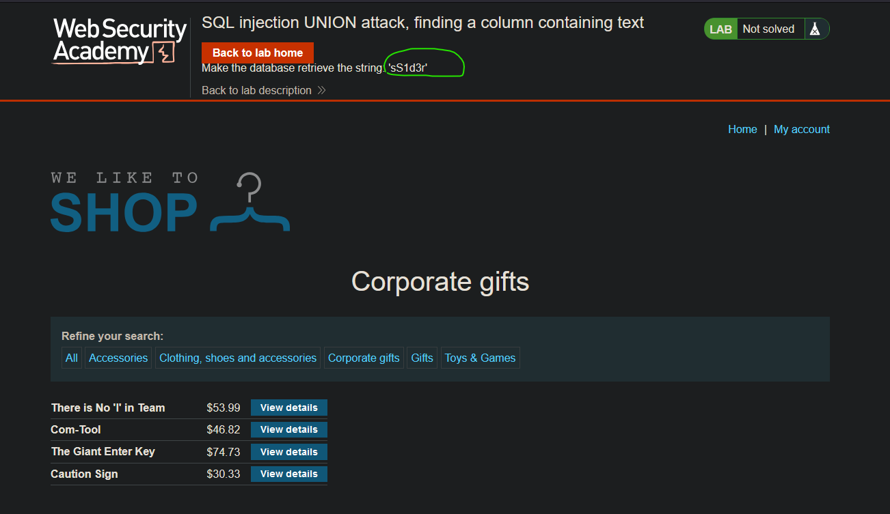
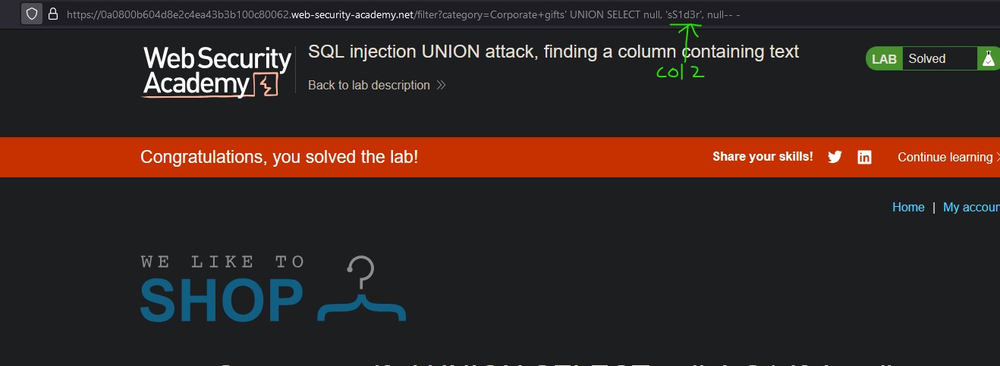

# Lab06: SQL injection UNION attack, finding a column containing text
* url: `https://portswigger.net/web-security/sql-injection/union-attacks/lab-find-column-containing-text`
* vulnerability: `Union-Based SQL Injection`

## Description 
This lab contains a SQL injection vulnerability in the product category filter. The results from the query are returned in the application's response, so you can use a UNION attack to retrieve data from other tables. To construct such an attack, you first need to determine the number of columns returned by the query. You can do this using a technique you learned in a previous lab. The next step is to identify a column that is compatible with string data.

The lab will provide a random value that you need to make appear within the query results. To solve the lab, perform a SQL injection UNION attack that returns an additional row containing the value provided. This technique helps you determine which columns are compatible with string data. 

## Proof of Concept
1. I navigate to any of the product category filter hyperlinks. For this lab, I chose to use `Corporate Gifts`, but you can choose any of them, because they are all vulnerable. 
2. From the previous lab (`sqli-practitioner-lab05`), I know that the number of columns needed for the UNION attack is `3`. So, to solve this lab, I just need to return the string that's presented on the page:  

3. What's important to note that the corresponding columns from the original query needs to align with the datatype of the my UNION injection. Since, we're trying to return a string, I can test each of the columns for their data type. I start from column like: `' UNION SELECT 'sS1d3r', null, null-- -` and I test each column until I do not run into an internal server error. It looks like column2 is the correct column datatype for strings:  

