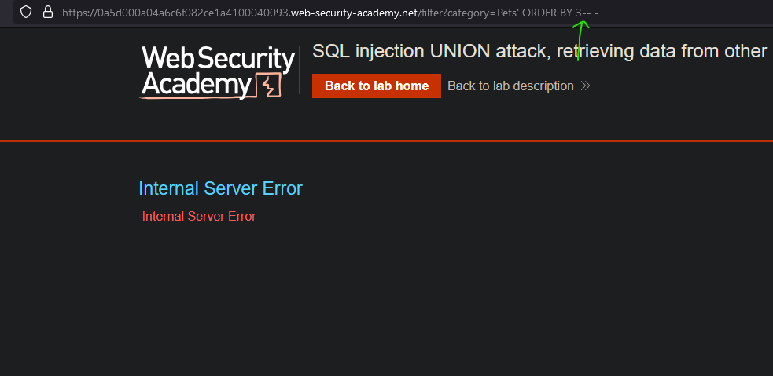
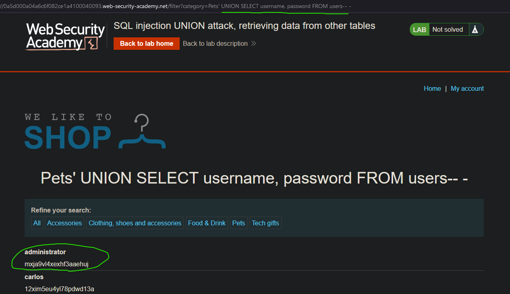
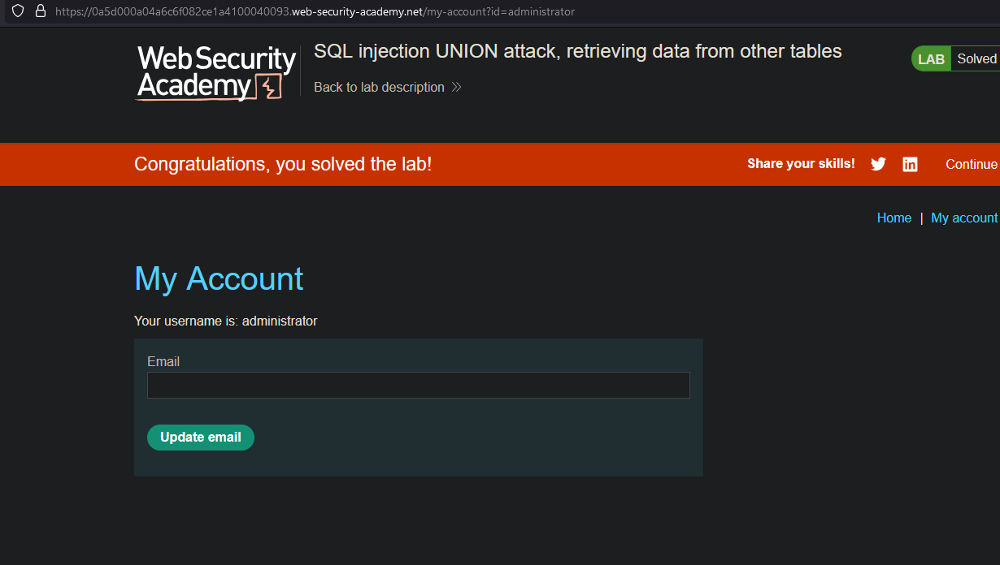

# Lab07: SQL injection UNION attack, retrieving data from other tables
* url: `https://portswigger.net/web-security/sql-injection/union-attacks/lab-retrieve-data-from-other-tables`
* vulnerability: `Union-Based SQL Injection`

## Description 
This lab contains a SQL injection vulnerability in the product category filter. The results from the query are returned in the application's response, so you can use a UNION attack to retrieve data from other tables. To construct such an attack, you need to combine some of the techniques you learned in previous labs.

The database contains a different table called users, with columns called username and password.

To solve the lab, perform a SQL injection UNION attack that retrieves all usernames and passwords, and use the information to log in as the administrator user. 

## Proof of Concept
1. Because the table `users` is within the current database of our user, I can craft a UNION payload that looks like: `' UNION SELECT username, password FROM users-- -`. However, before injecting this payload I must check for the number of columns used in the original query. 
2. I use the `ORDER BY X` method from previous labs to find the number of columns:  

3. Because I experience an internal server error on `' ORDER BY 3-- -`, I can deduce that the number columns I need is `2`, which is perfect for this lab. 
4. I can now use my original payload from step one to extract data from the `users` table:  

5. It looks like the `administrator` user has a password of `mxja9vl4xexhf3aaehuj`. So I can use these credentials to log in and solve the lab!   

