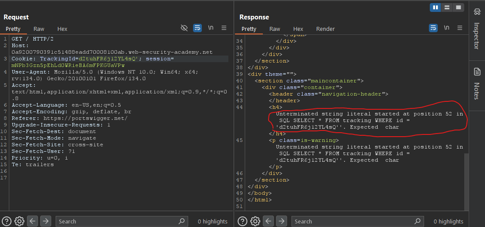
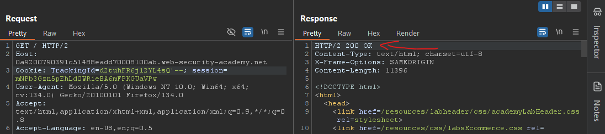
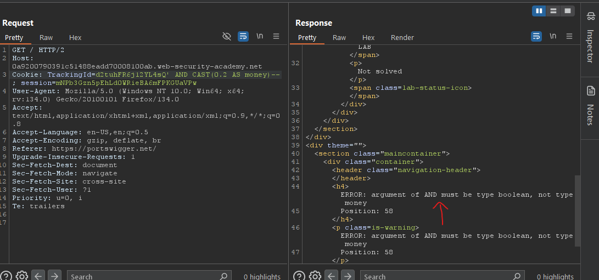
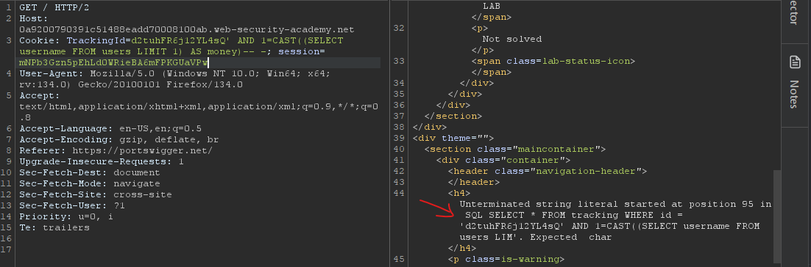
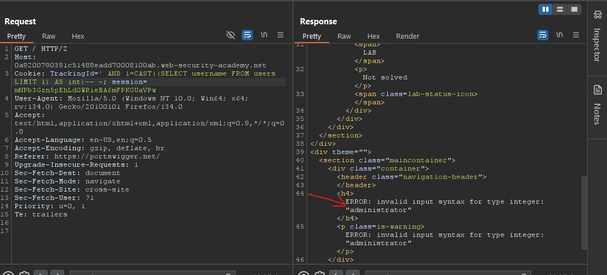
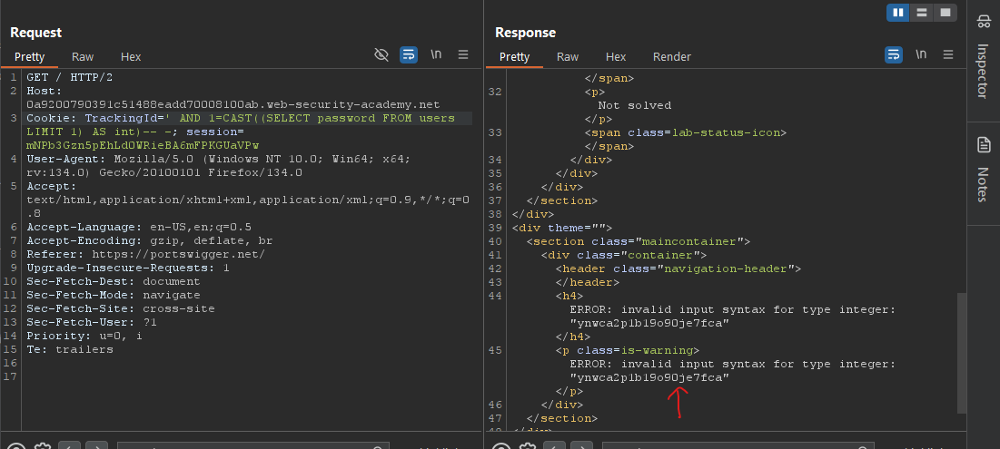

# Lab11: Visible error-based SQL injection
* url: `https://portswigger.net/web-security/sql-injection/blind/lab-sql-injection-visible-error-based`
* vulnerability: `Blind SQL Injection`

## Description 
This lab contains a SQL injection vulnerability. The application uses a tracking cookie for analytics, and performs a SQL query containing the value of the submitted cookie. The results of the SQL query are not returned.

The database contains a different table called users, with columns called username and password. To solve the lab, find a way to leak the password for the administrator user, then log in to their account. 

## Proof of Concept
1. Intercept the request in Burp Suite and inject a `'` at the end of the `TrackingId` value to check for the possibility of a SQLi. You can see that in the response, it gives a Status 500 Internal Server Error, however if we scroll down, we can actually see the full error message, which leaks the query structure that's used in the backend. This is called a `verbose error message`. This is a different kind of error message than what we've seen in the previous lab.   

2. Now that we know what the query is (`SELECT * FROM tracking WHERE id = 'd2tuhFR6j12YL4sQ'`), we can easily alter our payload to fix the syntax of the SQL query by changing our payload from `'` to `'--`  

3. Because we know that the web application is leaking information through its verbose error messages, we can utilize something like `CAST()` in order to trick the web app to give us the information that we want. For example, I can change the payload to: `' AND CAST(0.2 AS money)-- -`  

4. In the verbose error message, I'm told that the argument of `AND` must be type boolean. So, we can alter our payload to: `' AND 1=CAST((SELECT username FROM users LIMIT 1) AS money)-- -` This will do multiple things at once: it will check for the existence of the users table as well as the user column, as well as change our payload to a boolean expression.   

5. In the error message, you can observe that the query is cut off/truncated at the "LIMIT 1" part. This suggests that there is some type of validation/sanitization on the backend that checks for the length of the input. But I can get around this by just deleting the `TrackingId` value to make more space! (I can also choose the data type of CAST() to be something shorter like `int` as opposed to `money`)  

6. Now we see an interesting error message from the previous screenshot. It leaks information that the first user is `administrator` (because of LIMIT 1 in the payload) and that `admministrator` cannot be converted into an integer. We can build on our latest payload to: `' AND 1=CAST((SELECT password FROM users LIMIT 1) AS int)-- -`. This should leak the password for the first user `administrator`:  

7. Great! Now I can use the user value of `administrator` and the password value of `ynwca2p1b19o90je7fca` to log in and solve the lab. 
## Notes
* `CAST()` converts a value (of any type) into a specified datatype. 
  * Syntax: `CAST(expression AS datatype)`
    * `expression`: The value to convert
    * `datatype`: The datatype to convert expression to. Can be one of the following: bigint, int, smallint, tinyint, bit, decimal, numeric, money, smallmoney, float, real, datetime, smalldatetime, char, varchar, text, nchar, nvarchar, ntext, binary, varbinary, or image
